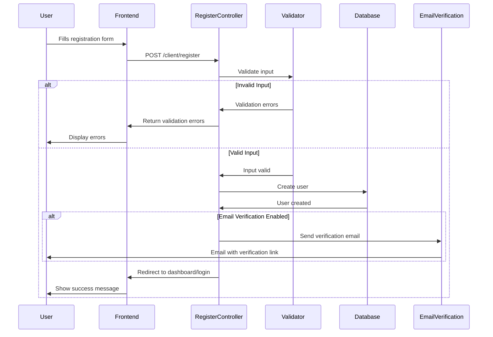
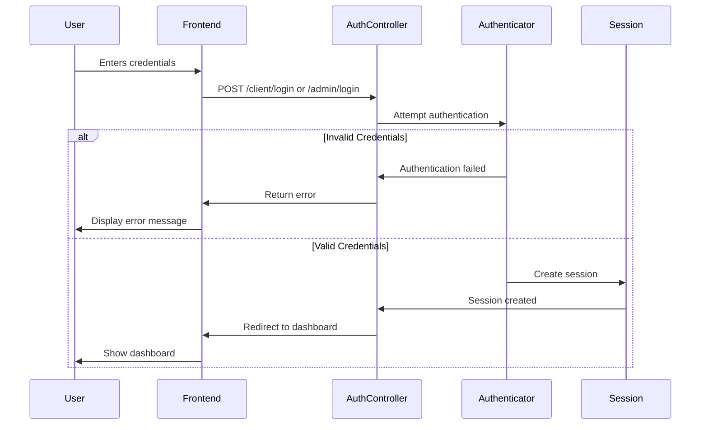
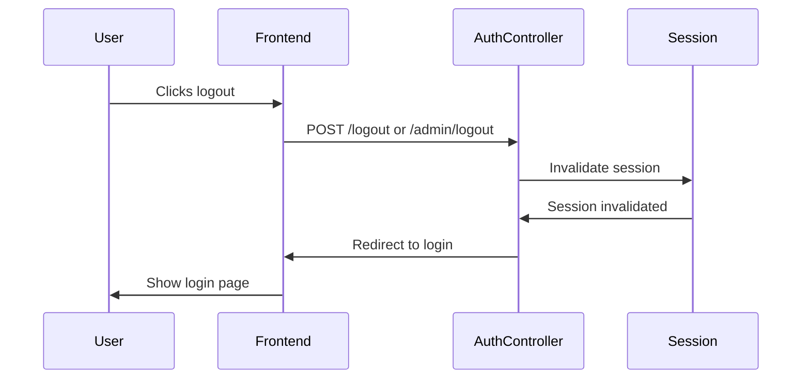
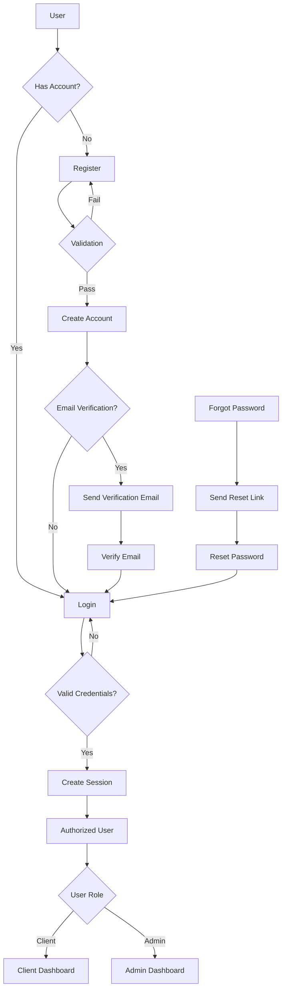
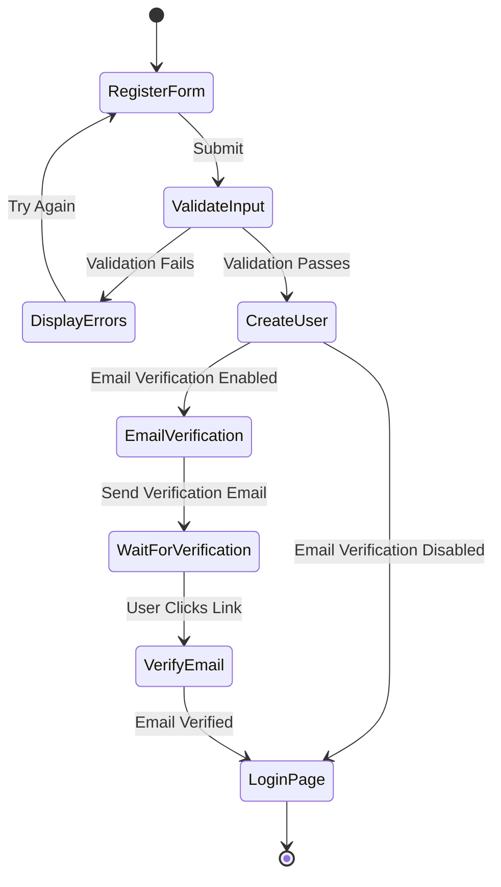
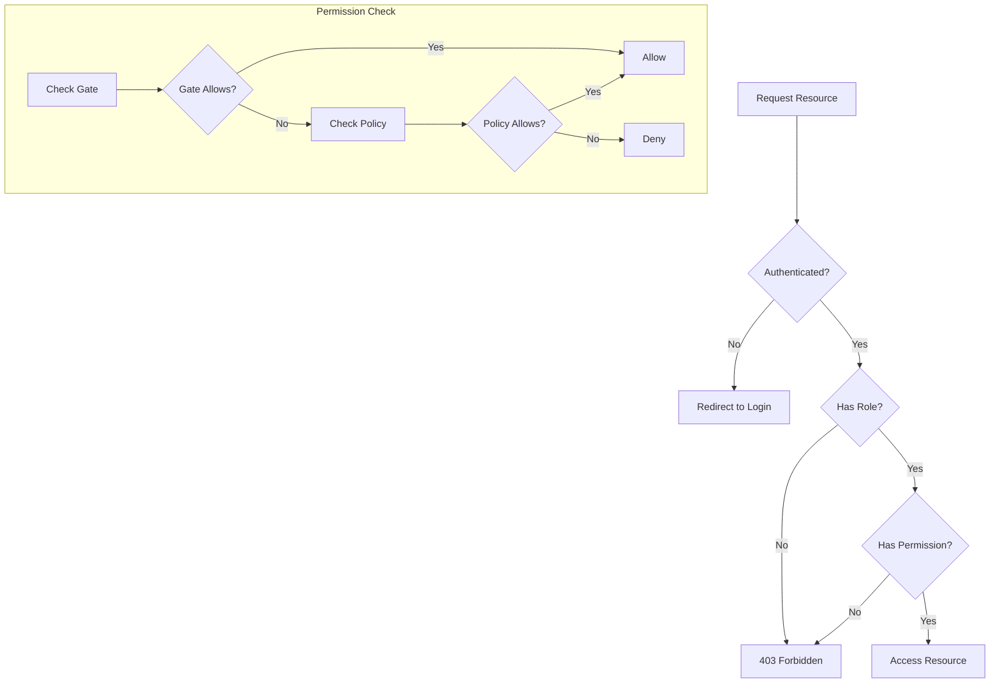
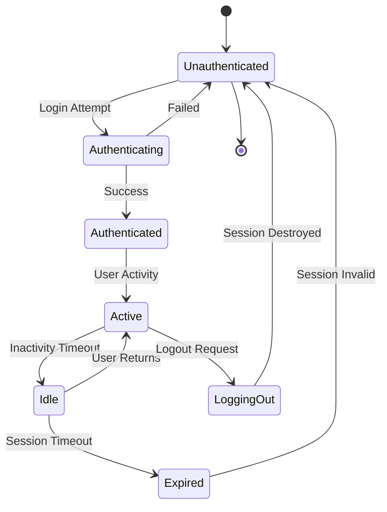

# Authentication Documentation

## Overview

The Cinema System Management application implements a comprehensive authentication system using Laravel Sanctum, integrated with Inertia.js for a seamless single-page application experience. This document details the authentication architecture, flows, and security considerations across the application.

## Technologies Used

- **Laravel Sanctum**: Authentication system for Laravel applications
- **Inertia.js**: Connects the Laravel backend with React frontend
- **React**: Frontend framework handling the UI
- **PHP**: Backend language
- **Laravel**: PHP framework for web application development

## User Types and Roles

The application supports multiple user types with different authentication flows:

1. **Regular Users (Clients)**

    - Can register accounts
    - Full authentication cycle (register, login, password reset)
    - Access to client-specific features (film browsing, reservations)

2. **Administrators**
    - No self-registration (created by system or other admins)
    - Login-only authentication
    - Access to administrative features (film management, user management)

## Authentication Flow

### Registration Process



### Login Process



### Logout Process



## Session Management

The application uses Laravel's session management with Sanctum for authentication:

### Session Configuration

- **Session Driver**: Database (configurable)
- **Session Lifetime**: 120 minutes (configurable)
- **Session Encryption**: Enabled

### Session Handling

1. **Creation**: Session is created upon successful authentication
2. **Storage**: Session data is stored server-side
3. **Client Identification**: Session ID is stored in an HTTP-only cookie
4. **Expiration**: Sessions expire after inactivity period or on logout

## Authentication Implementation Details

### Laravel Sanctum Integration

Laravel Sanctum is used for authentication, providing:

1. **Cookie-based Authentication**: For web requests via Inertia.js
2. **Token-based Authentication**: For API requests (where applicable)

### Routes Definition

Authentication routes are defined in `routes/auth.php`:

```php
// Client Auth Routes
Route::middleware('guest')->group(function () {
    Route::get('client/register', [RegisteredUserController::class, 'create'])
        ->name('register');
    Route::post('client/register', [RegisteredUserController::class, 'store']);
    Route::get('client/login', [AuthenticatedSessionController::class, 'create'])
        ->name('login');
    Route::post('client/login', [AuthenticatedSessionController::class, 'store']);
    // Password reset routes...
});

// Admin Auth Routes - Login Only (No Registration)
Route::middleware('guest:admin')->prefix('admin')->name('admin.')->group(function () {
    Route::get('/login', [AuthenticatedSessionController::class, 'create'])
        ->name('login');
    Route::post('/login', [AuthenticatedSessionController::class, 'store']);
});

// Protected routes for authenticated users...
Route::middleware('auth:web')->group(function () {
    // Email verification routes...
    // Password confirmation routes...
    Route::post('logout', [AuthenticatedSessionController::class, 'destroy'])
        ->name('logout');
});

// Admin logout route
Route::middleware('auth:admin')->group(function () {
    Route::post('admin/logout', [AuthenticatedSessionController::class, 'destroy'])
        ->name('admin.logout');
});
```

### Controller Implementation

Authentication is handled by dedicated controllers in the `App\Http\Controllers\Auth` namespace:

1. **RegisteredUserController**: Handles user registration
2. **AuthenticatedSessionController**: Manages login and logout
3. **PasswordResetLinkController**: Initiates password reset
4. **NewPasswordController**: Handles password reset form submission
5. **EmailVerificationPromptController**: Handles email verification prompts
6. **VerifyEmailController**: Verifies emails using signed URLs

### Frontend Implementation

The frontend uses Inertia.js to interact with the authentication system:

1. **Login Form**: Submits credentials to the Laravel backend
2. **Registration Form**: Collects user information for registration
3. **Password Reset Form**: Allows users to reset their password

Example login form with Inertia.js:

```tsx
import { useForm } from '@inertiajs/react';

export default function Login() {
    const { data, setData, post, processing, errors } = useForm({
        email: '',
        password: '',
        remember: false,
    });

    function submit(e: React.FormEvent) {
        e.preventDefault();
        post(route('login'));
    }

    return <form onSubmit={submit}>{/* Form fields */}</form>;
}
```

## Role-Based Access Control

The application implements role-based access control (RBAC) to restrict access to features:

### User Roles

1. **Client**: Regular user who can book reservations
2. **Admin**: Administrative user with management capabilities

### Role Implementation

Roles are stored in the `role` column of the `users` table:

```php
// User model
class User extends Authenticatable
{
    // ...

    protected $fillable = [
        'name',
        'email',
        'password',
        'role',
    ];

    // ...
}
```

### Authorization

Authorization is implemented using Laravel's policies and gates:

1. **Policies**: Define authorization rules for model operations
2. **Gates**: Define general authorization rules
3. **Middleware**: Enforces role requirements for routes

## Authentication Guards

The application uses multiple authentication guards:

1. **Web Guard**: Default guard for regular web users
2. **Admin Guard**: Separate guard for administrators

This is configured in `config/auth.php`:

```php
'guards' => [
    'web' => [
        'driver' => 'session',
        'provider' => 'users',
    ],

    'admin' => [
        'driver' => 'session',
        'provider' => 'users',
    ],

    'api' => [
        'driver' => 'sanctum',
        'provider' => 'users',
    ],
],
```

## Authorization Policies

Authorization policies define permissions for specific actions:

### Film Policy Example

```php
class FilmPolicy
{
    public function viewAny(User $user)
    {
        return true; // Anyone can view films
    }

    public function create(User $user)
    {
        return $user->role === 'admin'; // Only admins can create films
    }

    public function update(User $user, Film $film)
    {
        return $user->role === 'admin'; // Only admins can update films
    }

    public function delete(User $user, Film $film)
    {
        return $user->role === 'admin'; // Only admins can delete films
    }
}
```

## UML Diagrams

### Authentication Flow



### Registration Process



### Authorization Decision Tree



### User Session Lifecycle



## Security Considerations

### Password Policies

- Minimum length: 8 characters
- Requires: Uppercase, lowercase, numbers, special characters
- Storage: Bcrypt hashing algorithm

### CSRF Protection

- CSRF tokens required for all state-changing operations
- Inertia.js automatically includes CSRF tokens in requests

### Session Security

- HTTP-only cookies
- Encrypted sessions
- Same-site cookie policy
- Session regeneration on privilege level change

### Rate Limiting

- Login attempts rate limited
- Password reset requests rate limited
- API endpoints rate limited

### Security Headers

- Content Security Policy (CSP)
- X-XSS-Protection
- X-Frame-Options
- X-Content-Type-Options

## Testing Authentication

The application includes comprehensive tests for authentication:

1. **Registration Tests**: Verify registration workflow
2. **Login Tests**: Ensure login works correctly
3. **Password Reset Tests**: Validate password reset functionality
4. **Authorization Tests**: Confirm access controls work as expected

Example test for login:

```php
public function test_users_can_authenticate_using_the_login_screen()
{
    $user = User::factory()->create();

    $response = $this->post('/client/login', [
        'email' => $user->email,
        'password' => 'password',
    ]);

    $this->assertAuthenticated();
    $response->assertRedirect(RouteServiceProvider::HOME);
}
```

## Best Practices Implemented

1. **Secure Password Handling**: Passwords are never stored in plain text
2. **Authentication Timeouts**: Sessions expire after periods of inactivity
3. **Rate Limiting**: Prevents brute force attacks
4. **Principle of Least Privilege**: Users only have access to what they need
5. **Defense in Depth**: Multiple layers of security
6. **Input Validation**: All user input is validated
7. **Secure Defaults**: Security-first approach to configuration
8. **Regular Updates**: Dependencies kept updated to patch vulnerabilities

## Integration with Inertia.js

Inertia.js provides a seamless authentication experience:

1. **Auth State Sharing**: Authentication state passed from Laravel to React
2. **Form Handling**: Simplifies form submissions and validation error handling
3. **Redirect Handling**: Manages post-authentication redirects
4. **Flash Messages**: Displays authentication-related messages

## Conclusion

The authentication system for the Cinema System Management application provides a robust, secure, and user-friendly experience. It leverages Laravel Sanctum and Inertia.js to create a seamless authentication flow while maintaining strong security practices and role-based access control.

This document serves as a comprehensive guide to understanding the authentication architecture, flows, and security considerations for developers working on the application.
