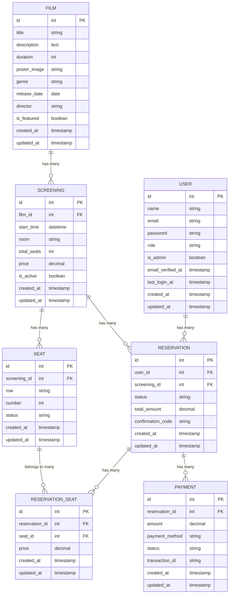
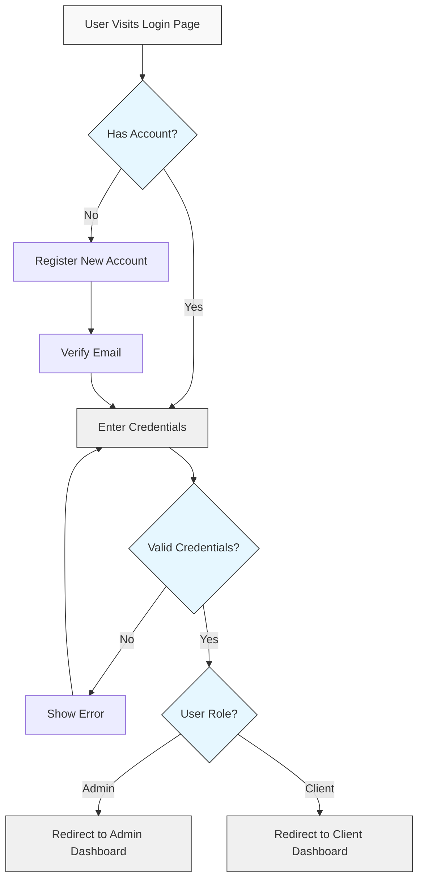
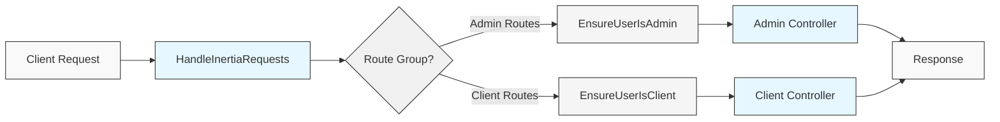
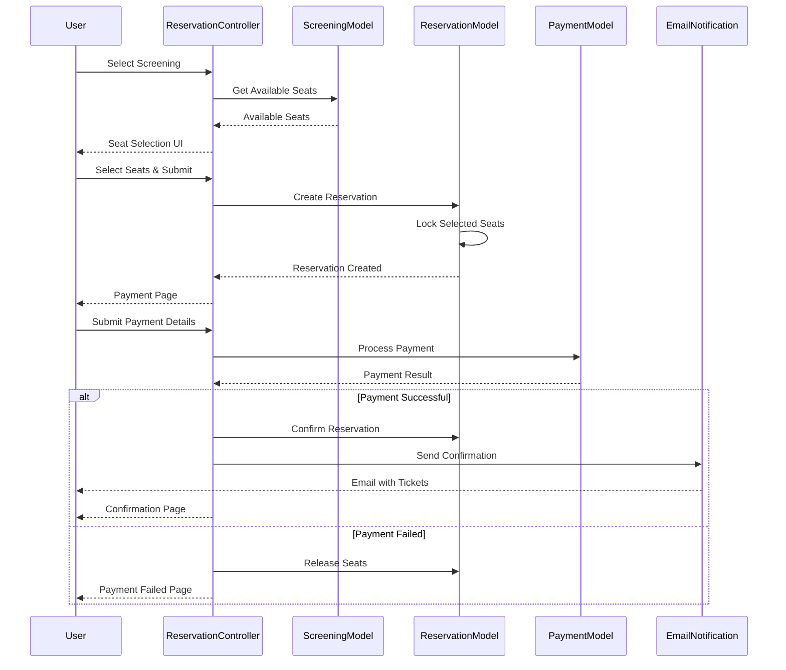

# Backend Documentation

## Overview

This document provides a comprehensive overview of the backend architecture for the cinema management system. The application is built using Laravel PHP framework with MySQL database, following MVC design pattern and RESTful API principles.

## Tech Stack

- **Framework**: Laravel
- **Language**: PHP
- **Database**: MySQL
- **Authentication**: Laravel's built-in authentication with guards for multi-role support
- **API**: RESTful API endpoints
- **Frontend Integration**: Inertia.js
- **File Storage**: Laravel's Storage facade

## Architecture

The backend follows a layered architecture with clear separation of concerns:

```
app/
├── Console/              # Console commands
├── Exceptions/           # Exception handlers
├── Http/
│   ├── Controllers/      # Request handlers
│   │   ├── Admin/        # Admin area controllers
│   │   ├── Api/          # API controllers
│   │   ├── Auth/         # Authentication controllers
│   │   └── Settings/     # Settings controllers
│   ├── Middleware/       # HTTP middleware
│   └── Requests/         # Form requests for validation
├── Models/               # Database models
├── Notifications/        # Notification classes
├── Policies/             # Authorization policies
├── Providers/            # Service providers
└── Services/             # Business logic services
```

## Database Schema

The application uses a relational database with the following main tables:

- **users**: Stores user authentication and profile data
- **films**: Stores movie information
- **screenings**: Stores screening schedule information
- **seats**: Stores seat information per screening
- **reservations**: Stores ticket booking information
- **reservation_seats**: Maps reservations to specific seats
- **payments**: Stores payment information for reservations

## Models and Relationships

### Entity Relationship Diagram



## Controller Structure

The application follows RESTful controller patterns with specialized controllers for different domains:

### Class Hierarchy

```mermaid
classDiagram
    class Controller {
        +__construct()
    }

    class FilmController {
        +index(Request request)
        +show(Film film)
        +home()
    }

    class ReservationController {
        +seatSelection(Screening screening)
        +store(Request request, Screening screening)
        +payment(Reservation reservation)
        +processPayment(Request request, Reservation reservation)
        +confirmation(Reservation reservation)
        +downloadTicket(Reservation reservation)
        +userReservations()
        +show(Reservation reservation)
    }

    class AccountController {
        +index()
        +settings()
        +updateProfile(Request request)
        +updatePassword(Request request)
    }

    class AdminFilmController {
        +index(Request request)
        +create()
        +store(Request request)
        +edit(Film film)
        +update(Request request, Film film)
        +destroy(Film film)
    }

    class AdminReservationController {
        +index(Request request)
        +show(Reservation reservation)
        +updateStatus(Request request, Reservation reservation)
        +destroy(Reservation reservation)
    }

    class ScreeningController {
        +index(Request request)
        +create()
        +store(Request request)
        +edit(Screening screening)
        +update(Request request, Screening screening)
        +destroy(Screening screening)
        +filmScreenings(Film film)
        +repairSeats(Screening screening)
    }

    class AuthController {
        +login()
        +authenticate(Request request)
        +logout(Request request)
    }

    Controller <|-- FilmController
    Controller <|-- ReservationController
    Controller <|-- AccountController
    Controller <|-- AdminFilmController
    Controller <|-- AdminReservationController
    Controller <|-- ScreeningController
    Controller <|-- AuthController
```



## Authentication Flow

The application uses Laravel's authentication system with multiple guards for different user roles:



## Middleware Pipeline

The application uses middleware to handle authentication, authorization, and other cross-cutting concerns:



## Reservation Flow

The reservation process follows a multi-step flow with transaction handling:



## Key Files and Their Responsibilities

### Models

- **Film.php**: Manages film data with relationships to screenings and reservations
- **Screening.php**: Handles screening schedules with seat availability tracking
- **Seat.php**: Manages individual seats for screenings
- **Reservation.php**: Handles booking data with payment processing
- **User.php**: Manages user authentication and profile data

### Controllers

- **FilmController.php**: Handles film listing and details for customers
- **ReservationController.php**: Manages the reservation process flow
- **Admin/FilmController.php**: Provides CRUD operations for films in admin area
- **Admin/ScreeningController.php**: Manages screening schedules in admin area
- **Admin/ReservationController.php**: Handles reservation management in admin area

### Middleware

- **EnsureUserIsAdmin.php**: Protects admin routes from unauthorized access
- **EnsureUserIsClient.php**: Ensures user has appropriate client role
- **HandleInertiaRequests.php**: Prepares data for Inertia.js frontend

## API Endpoints

The application provides API endpoints for internal use by the frontend:

### Film Endpoints

- `GET /api/films`: Get list of films with pagination
- `GET /api/films/{id}`: Get details of a specific film
- `POST /api/films` (Admin): Create a new film
- `PUT /api/films/{id}` (Admin): Update film details
- `DELETE /api/films/{id}` (Admin): Delete a film

### Screening Endpoints

- `GET /api/screenings`: Get list of screenings
- `GET /api/films/{id}/screenings`: Get screenings for a specific film
- `GET /api/screenings/{id}/seats`: Get seat availability for a screening
- `POST /api/screenings` (Admin): Create a new screening
- `PUT /api/screenings/{id}` (Admin): Update screening details

### Reservation Endpoints

- `POST /api/reservations`: Create a new reservation
- `GET /api/reservations/{code}`: Get reservation details by confirmation code
- `GET /api/user/reservations`: Get all reservations for the authenticated user
- `POST /api/reservations/{id}/payment`: Process payment for a reservation

## Security Considerations

The backend implements these security measures:

1. **Authentication**: Laravel's secure authentication system
2. **Authorization**: Policy-based access control for resources
3. **CSRF Protection**: Cross-site request forgery protection
4. **Validation**: Input validation using Form Request classes
5. **Database**: Parameterized queries to prevent SQL injection
6. **Sessions**: Secure session handling with regeneration
7. **File Uploads**: Validation of uploaded files and secure storage

## Error Handling

The application uses Laravel's exception handling system with customized responses:

1. **Validation Errors**: Returned as structured JSON for API requests
2. **Authentication Errors**: Redirect to login or return 401 responses
3. **Authorization Errors**: Return 403 responses with appropriate messages
4. **Not Found Errors**: Return 404 responses or redirect to fallback routes
5. **Server Errors**: Logged for debugging and generic error shown to users

## Database Transactions

Critical operations are wrapped in database transactions to ensure data integrity:

1. **Reservation Creation**: Seats reservation and payment processing
2. **Screening Management**: Seat creation and management
3. **User Registration**: User creation and initial settings

## Performance Optimizations

The application implements these performance optimizations:

1. **Eager Loading**: Avoid N+1 query issues with relationships
2. **Caching**: Cache frequently accessed data like film listings
3. **Pagination**: Paginate large result sets
4. **Indexing**: Database indexes on frequently queried columns
5. **Query Optimization**: Optimized queries for performance

## Admin Features

The admin area provides these management capabilities:

1. **Dashboard**: Overview with key metrics and statistics
2. **Film Management**: CRUD operations for films
3. **Screening Management**: Schedule management with seat setup
4. **Reservation Management**: View, update, and cancel reservations
5. **Report Generation**: Box office, revenue, and attendance reports

## Conclusion

The backend architecture provides a robust foundation for the cinema management system with a focus on security, performance, and maintainability. The MVC design pattern with clear separation of concerns allows for easy extension and modification as requirements evolve.
