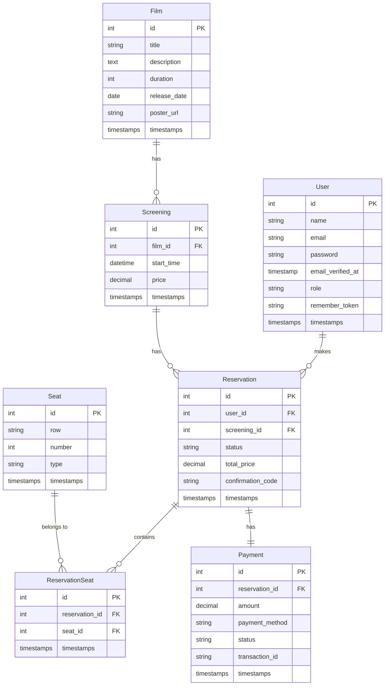
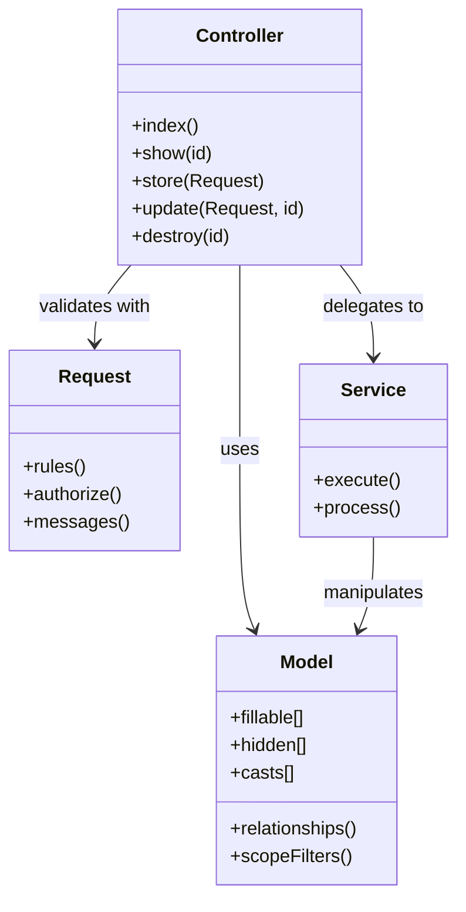
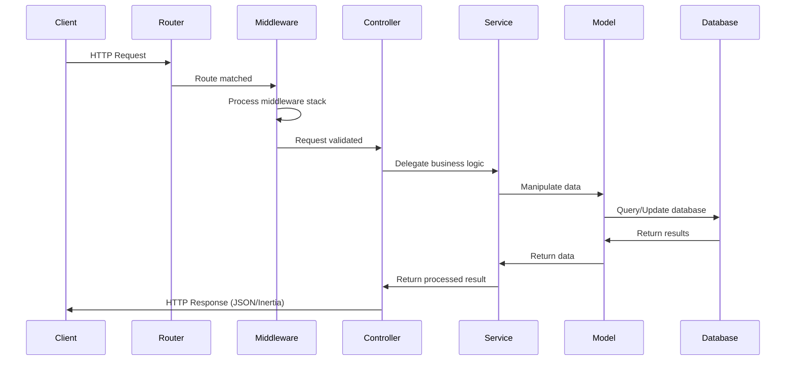
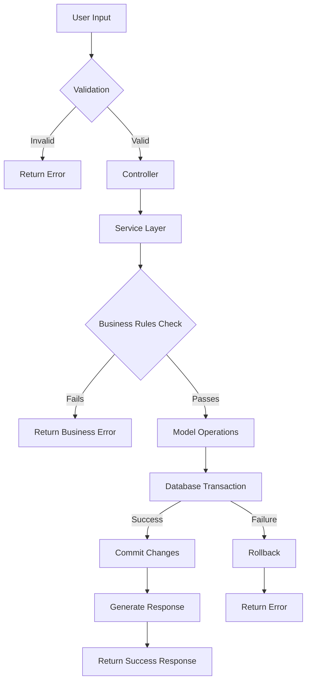

# Backend Documentation

## Overview

The backend of the Cinema System Management application is built using Laravel, a popular PHP framework that follows the MVC (Model-View-Controller) architectural pattern. This document details the architecture, components, and implementation patterns used in the backend codebase.

## Technologies Used

- **Laravel 12**: PHP framework for web application development
- **PHP 8.2+**: Programming language
- **MySQL/PostgreSQL**: Relational database management system
- **Laravel Sanctum**: Authentication system
- **Inertia.js Server Adapter**: Bridge between Laravel and React
- **DomPDF**: PDF generation for tickets and reports
- **PHP Barcode Generator**: Barcode generation for tickets

## MVC Architecture

Laravel implements the Model-View-Controller (MVC) architectural pattern, which separates the application into three main components:

### Models

Models represent the data structure and business logic of the application. They interact with the database and define relationships between different data entities.

### Views

In a traditional Laravel application, views would be Blade templates. However, in this Inertia.js-based application, views are replaced by React components on the frontend. Laravel controllers return Inertia responses that render React components with the provided data.

### Controllers

Controllers handle HTTP requests, process data using models, and return responses. They act as the intermediary between the models and the views (React components).

## Directory Structure

```
app/
├── Console/                # Console commands
├── Http/
│   ├── Controllers/        # Request handlers
│   │   ├── Admin/          # Admin-specific controllers
│   │   ├── Api/            # API controllers
│   │   ├── Auth/           # Authentication controllers
│   │   └── Settings/       # Settings controllers
│   ├── Middleware/         # HTTP middleware
│   └── Requests/           # Form requests and validation
├── Models/                 # Database models
├── Notifications/          # Notification classes
├── Policies/               # Authorization policies
├── Providers/              # Service providers
└── Services/               # Business logic services
```

## Controllers and Their Responsibilities

Controllers are responsible for handling HTTP requests, processing data, and returning responses. The application organizes controllers based on their functionality:

### Main Controllers

- **FilmController**: Manages film-related operations (listing, creation, updating, deletion)
- **ReservationController**: Handles seat reservations, confirmations, and cancellations
- **AccountController**: Manages user account operations

### Admin Controllers

- **Admin\FilmController**: Admin-specific film management
- **Admin\ScreeningController**: Management of film screenings
- **Admin\UserController**: User management by administrators
- **Admin\ReportController**: Generation of various reports

### API Controllers

- **Api\FilmController**: RESTful API endpoints for films
- **Api\ReservationController**: API for handling reservations
- **Api\PaymentController**: API endpoints for payment processing

### Auth Controllers

- **Auth\AuthenticatedSessionController**: Handles login sessions
- **Auth\RegisteredUserController**: Manages user registration
- **Auth\PasswordResetLinkController**: Handles password reset requests

## Models and Database Relationships

The application's data is represented by the following key models:

### Core Models

1. **User**

    - Represents users of the system (clients and administrators)
    - Relationships:
        - Has many reservations

2. **Film**

    - Represents a film/movie
    - Relationships:
        - Has many screenings

3. **Screening**

    - Represents a specific showing of a film
    - Relationships:
        - Belongs to a film
        - Has many reservations
        - Has many seats through reservations

4. **Reservation**

    - Represents a booking made by a user
    - Relationships:
        - Belongs to a user
        - Belongs to a screening
        - Has many reservation seats
        - Has one payment

5. **Seat**

    - Represents a seat in the cinema
    - Relationships:
        - Has many reservation seats

6. **ReservationSeat**

    - Pivot model for reservation-seat relationship
    - Relationships:
        - Belongs to a reservation
        - Belongs to a seat

7. **Payment**
    - Represents a payment for a reservation
    - Relationships:
        - Belongs to a reservation

## Database Schema



## Middleware Implementation

Middleware acts as a filtering mechanism for HTTP requests. The application uses both Laravel's built-in middleware and custom middleware:

### Key Middleware

1. **Authentication Middleware**

    - `auth`: Ensures the user is authenticated
    - `auth:admin`: Ensures the user is authenticated as an admin

2. **CSRF Protection**

    - `web`: Applies CSRF protection to routes

3. **Custom Middleware**
    - `EnsureUserHasRole`: Checks if user has the required role to access a resource
    - `HandleInertiaRequests`: Prepares shared data for Inertia requests

## API Endpoints

The application provides a RESTful API for various operations:

### Film Endpoints

- `GET /api/films`: List all films
- `GET /api/films/{id}`: Get a specific film
- `POST /api/films`: Create a new film (admin only)
- `PUT /api/films/{id}`: Update a film (admin only)
- `DELETE /api/films/{id}`: Delete a film (admin only)

### Reservation Endpoints

- `GET /api/reservations`: List user's reservations
- `GET /api/reservations/{id}`: Get a specific reservation
- `POST /api/reservations`: Create a new reservation
- `PUT /api/reservations/{id}`: Update a reservation
- `DELETE /api/reservations/{id}`: Cancel a reservation

### Payment Endpoints

- `POST /api/payments`: Process a payment
- `GET /api/payments/{id}`: Get payment details

## Form Validation

Laravel's form request validation is used to validate incoming HTTP requests:

```php
// Example validation rules for creating a film
public function rules(): array
{
    return [
        'title' => 'required|string|max:255',
        'description' => 'required|string',
        'duration' => 'required|integer|min:1',
        'release_date' => 'required|date',
        'poster_url' => 'nullable|url|max:255',
    ];
}
```

Common validation patterns include:

- Required fields
- String length validation
- Numeric range validation
- Date format validation
- Unique constraints for database fields
- Custom validation rules

## Service Classes and Helpers

The application uses service classes to encapsulate business logic:

### Key Services

1. **ReservationService**

    - Handles reservation creation, modification, and cancellation
    - Manages seat availability and reservation status changes

2. **PaymentService**

    - Processes payments
    - Integrates with payment gateways
    - Handles payment status updates

3. **PDFService**

    - Generates PDF tickets for reservations
    - Creates reports for administrators

4. **NotificationService**
    - Manages email notifications
    - Sends confirmation emails and reminders

## UML Diagrams

### MVC Relationships



### Request Lifecycle



### Business Logic Flow



## Authentication and Authorization

### Authentication

- Laravel Sanctum is used for authentication
- Session-based authentication for web requests
- Token-based authentication for API requests

### Authorization

- Role-based access control using Laravel's Gate and Policy features
- Admin and regular user roles with different permissions
- Authorization logic encapsulated in Policy classes

## Error Handling

- Global exception handler customizes error responses
- API errors return appropriate HTTP status codes and JSON responses
- Validation errors are returned in a consistent format
- Inertia.js error handling for frontend errors

## Testing

The backend includes comprehensive testing using PHPUnit:

- Feature tests for testing HTTP endpoints
- Unit tests for testing individual components
- Database tests for testing database interactions
- Mocking external services for isolated testing

## Deployment and Performance

- Database query optimization with eager loading
- Caching strategy for frequently accessed data
- Queue system for background processing
- Proper indexes on database tables

## Best Practices

1. **Single Responsibility Principle**: Each class has a single responsibility
2. **Dependency Injection**: Dependencies are injected rather than created
3. **Fat Models, Skinny Controllers**: Business logic is kept in models or services
4. **Validation**: All input is validated before processing
5. **Service Layer**: Complex business logic is encapsulated in service classes
6. **Database Transactions**: Used for operations that require multiple database changes

This documentation provides a comprehensive overview of the backend architecture of the Cinema System Management application. It details the structure, patterns, and best practices used in the codebase to help developers understand and contribute to the project effectively.
