# Class Diagram Documentation

## Overview

This document provides a comprehensive overview of the class structure for the cinema management system. It illustrates the relationships between different classes in the application, their properties, methods, and how they interact with each other.

## Application Architecture Class Diagram

## Model Layer Class Diagram

## Controller Layer Class Diagram

## Service Layer Class Diagram

```mermaid
classDiagram
    class PaymentService {
        +processPayment(Reservation reservation, array paymentDetails)
        +generateTransactionId(): string
        +validatePayment(array paymentDetails): bool
        +recordPayment(Reservation reservation, array paymentDetails): Payment
    }

    class ReservationService {
        +createReservation(Screening screening, array seatIds, User user): Reservation
        +calculateTotalAmount(Screening screening, array seatIds): decimal
        +reserveSeats(Reservation reservation, array seatIds)
        +releaseSeats(Reservation reservation)
        +generateConfirmationCode(): string
    }

    class PDFService {
        +generateTicket(Reservation reservation): PDF
        +generateHeader(): void
        +generateTicketDetails(Reservation reservation): void
        +generateQRCode(string confirmationCode): void
        +generateFooter(): void
    }

    class NotificationService {
        +sendTicketConfirmation(Reservation reservation)
        +sendPaymentConfirmation(Payment payment)
        +sendReservationReminder(Reservation reservation)
    }

    class FilmService {
        +getFiltered(array filters): Collection
        +getFeatured(): Collection
        +storeImage(UploadedFile image): string
        +deleteImage(string path): bool
    }

    class ScreeningService {
        +createWithSeats(array data): Screening
        +setupSeats(Screening screening)
        +getUpcoming(): Collection
        +checkAvailability(Screening screening): bool
    }

    class ReportService {
        +getFilmsStats(DatePeriod period): array
        +getRevenueStats(DatePeriod period): array
        +getScreeningsStats(DatePeriod period): array
        +getDashboardStats(): array
    }

    PaymentService --> Payment
    ReservationService --> Reservation
    ReservationService --> Seat
    PDFService --> Reservation
    NotificationService --> Reservation
    NotificationService --> Payment
    FilmService --> Film
    ScreeningService --> Screening
    ScreeningService --> Seat
    ReportService --> Film
    ReportService --> Screening
    ReportService --> Reservation
    ReportService --> Payment
```

## Middleware Class Diagram

## Authentication System Class Diagram

## Detailed Class Descriptions

### Models

#### User

Represents a user in the system with authentication information and role-based permissions.

- **Relations**: One-to-many with Reservations
- **Key Methods**: `isAdmin()`, `hasVerifiedEmail()`

#### Film

Represents a movie that can be screened in the cinema.

- **Relations**: One-to-many with Screenings, Has-many-through with Reservations
- **Key Methods**: `screenings()`, `futureScreenings()`, `getFeatured()`

#### Screening

Represents a scheduled showing of a film at a specific time and room.

- **Relations**: Belongs-to Film, One-to-many with Seats and Reservations
- **Key Methods**: `getAvailableSeatsCountAttribute()`, `getIsFullyBookedAttribute()`, `getEndTimeAttribute()`

#### Seat

Represents an individual seat for a screening.

- **Relations**: Belongs-to Screening, One-to-many with ReservationSeats
- **Key Methods**: `isAvailable()`, `getLabel()`

#### Reservation

Represents a booking made by a user for one or more seats at a screening.

- **Relations**: Belongs-to User and Screening, One-to-many with ReservationSeats and Payments
- **Key Methods**: `isPaid()`, `isConfirmed()`, `generateConfirmationCode()`

#### ReservationSeat

Represents the association between a reservation and a specific seat.

- **Relations**: Belongs-to Reservation and Seat

#### Payment

Represents a payment transaction for a reservation.

- **Relations**: Belongs-to Reservation
- **Key Methods**: `isCompleted()`, `markAsCompleted()`

### Controllers

#### FilmController

Handles client-facing film-related requests.

- **Key Methods**: `index()`, `show()`, `home()`

#### AdminFilmController

Handles admin film management operations.

- **Key Methods**: `index()`, `create()`, `store()`, `edit()`, `update()`, `destroy()`

#### ReservationController

Handles the reservation process for clients.

- **Key Methods**: `seatSelection()`, `store()`, `payment()`, `processPayment()`, `confirmation()`, `downloadTicket()`

#### AdminReservationController

Handles reservation management for admins.

- **Key Methods**: `index()`, `show()`, `updateStatus()`, `destroy()`

#### ScreeningController

Handles admin screening management operations.

- **Key Methods**: `index()`, `store()`, `update()`, `filmScreenings()`, `repairSeats()`

#### AccountController

Handles user account management operations.

- **Key Methods**: `index()`, `settings()`, `updateProfile()`, `updatePassword()`

### Services

#### PaymentService

Handles payment processing logic.

- **Key Methods**: `processPayment()`, `validatePayment()`, `recordPayment()`

#### ReservationService

Handles reservation business logic.

- **Key Methods**: `createReservation()`, `calculateTotalAmount()`, `reserveSeats()`, `releaseSeats()`

#### PDFService

Handles PDF generation for tickets.

- **Key Methods**: `generateTicket()`, `generateQRCode()`

#### NotificationService

Handles notification delivery for various events.

- **Key Methods**: `sendTicketConfirmation()`, `sendPaymentConfirmation()`, `sendReservationReminder()`

### Middleware

#### EnsureUserIsAdmin

Ensures that the authenticated user has admin privileges.

- **Key Methods**: `handle()`

#### EnsureUserIsClient

Ensures that the user has appropriate client role.

- **Key Methods**: `handle()`

#### HandleInertiaRequests

Prepares data for Inertia.js frontend.

- **Key Methods**: `handle()`, `share()`
