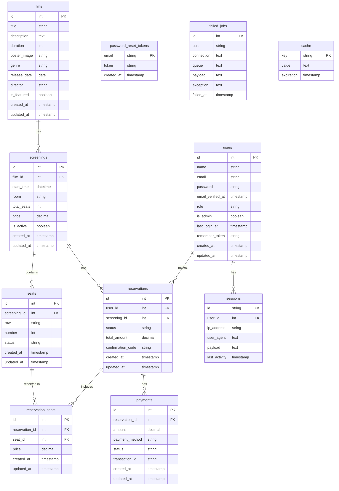

# Database Schema Documentation

## Overview

This document provides a comprehensive overview of the database schema for the cinema management system. The database is designed to support all aspects of the application including film management, screenings, seat reservations, user accounts, and payment processing.

## Entity Relationship Diagram

## Tables Description

### users

Stores user information, including authentication details and role information.

| Column            | Type      | Description                           | Constraints        |
| ----------------- | --------- | ------------------------------------- | ------------------ |
| id                | int       | Unique identifier                     | PK, Auto Increment |
| name              | string    | User's full name                      | Not Null           |
| email             | string    | User's email address                  | Not Null, Unique   |
| password          | string    | Hashed password                       | Not Null           |
| email_verified_at | timestamp | When email was verified               | Nullable           |
| role              | string    | User role (client, admin)             | Default: 'client'  |
| is_admin          | boolean   | Whether user has admin privileges     | Default: false     |
| last_login_at     | timestamp | Last login timestamp                  | Nullable           |
| remember_token    | string    | Token for "remember me" functionality | Nullable           |
| created_at        | timestamp | Record creation timestamp             | Auto               |
| updated_at        | timestamp | Record update timestamp               | Auto               |

### films

Stores information about movies available for screening.

| Column       | Type      | Description                          | Constraints        |
| ------------ | --------- | ------------------------------------ | ------------------ |
| id           | int       | Unique identifier                    | PK, Auto Increment |
| title        | string    | Movie title                          | Not Null           |
| description  | text      | Movie description/synopsis           | Not Null           |
| duration     | int       | Duration in minutes                  | Not Null           |
| poster_image | string    | Path to poster image file            | Nullable           |
| genre        | string    | Movie genre                          | Nullable           |
| release_date | date      | Release date                         | Nullable           |
| director     | string    | Movie director                       | Nullable           |
| is_featured  | boolean   | Whether film is featured on homepage | Default: false     |
| created_at   | timestamp | Record creation timestamp            | Auto               |
| updated_at   | timestamp | Record update timestamp              | Auto               |

### screenings

Stores scheduled movie screenings.

| Column      | Type      | Description                 | Constraints        |
| ----------- | --------- | --------------------------- | ------------------ |
| id          | int       | Unique identifier           | PK, Auto Increment |
| film_id     | int       | Related film                | FK, Not Null       |
| start_time  | datetime  | Screening start time        | Not Null           |
| room        | string    | Theater room identifier     | Not Null           |
| total_seats | int       | Total available seats       | Not Null           |
| price       | decimal   | Ticket price                | Not Null           |
| is_active   | boolean   | Whether screening is active | Default: true      |
| created_at  | timestamp | Record creation timestamp   | Auto               |
| updated_at  | timestamp | Record update timestamp     | Auto               |

### seats

Stores individual seats for screenings.

| Column       | Type      | Description                             | Constraints          |
| ------------ | --------- | --------------------------------------- | -------------------- |
| id           | int       | Unique identifier                       | PK, Auto Increment   |
| screening_id | int       | Related screening                       | FK, Not Null         |
| row          | string    | Seat row identifier                     | Not Null             |
| number       | int       | Seat number                             | Not Null             |
| status       | string    | Seat status (available, reserved, etc.) | Default: 'available' |
| created_at   | timestamp | Record creation timestamp               | Auto                 |
| updated_at   | timestamp | Record update timestamp                 | Auto                 |

### reservations

Stores customer booking information.

| Column            | Type      | Description               | Constraints        |
| ----------------- | --------- | ------------------------- | ------------------ |
| id                | int       | Unique identifier         | PK, Auto Increment |
| user_id           | int       | Related user              | FK, Nullable       |
| screening_id      | int       | Related screening         | FK, Not Null       |
| status            | string    | Reservation status        | Default: 'pending' |
| total_amount      | decimal   | Total price for all seats | Not Null           |
| confirmation_code | string    | Unique confirmation code  | Unique             |
| created_at        | timestamp | Record creation timestamp | Auto               |
| updated_at        | timestamp | Record update timestamp   | Auto               |

### reservation_seats

Maps reservations to specific seats.

| Column         | Type      | Description                    | Constraints        |
| -------------- | --------- | ------------------------------ | ------------------ |
| id             | int       | Unique identifier              | PK, Auto Increment |
| reservation_id | int       | Related reservation            | FK, Not Null       |
| seat_id        | int       | Related seat                   | FK, Not Null       |
| price          | decimal   | Price for this particular seat | Not Null           |
| created_at     | timestamp | Record creation timestamp      | Auto               |
| updated_at     | timestamp | Record update timestamp        | Auto               |

### payments

Stores payment information for reservations.

| Column         | Type      | Description                    | Constraints        |
| -------------- | --------- | ------------------------------ | ------------------ |
| id             | int       | Unique identifier              | PK, Auto Increment |
| reservation_id | int       | Related reservation            | FK, Not Null       |
| amount         | decimal   | Payment amount                 | Not Null           |
| payment_method | string    | Method of payment              | Not Null           |
| status         | string    | Payment status                 | Default: 'pending' |
| transaction_id | string    | Payment gateway transaction ID | Nullable           |
| created_at     | timestamp | Record creation timestamp      | Auto               |
| updated_at     | timestamp | Record update timestamp        | Auto               |

### sessions

Stores session information for users.

| Column        | Type      | Description                 | Constraints  |
| ------------- | --------- | --------------------------- | ------------ |
| id            | string    | Session ID                  | PK           |
| user_id       | int       | Related user                | FK, Nullable |
| ip_address    | string    | User's IP address           | Nullable     |
| user_agent    | text      | User's browser agent string | Nullable     |
| payload       | text      | Session data                | Not Null     |
| last_activity | timestamp | Last activity timestamp     | Not Null     |

### password_reset_tokens

Stores password reset tokens.

| Column     | Type      | Description              | Constraints |
| ---------- | --------- | ------------------------ | ----------- |
| email      | string    | User email address       | PK          |
| token      | string    | Reset token              | Not Null    |
| created_at | timestamp | Token creation timestamp | Not Null    |

### failed_jobs

Stores information about failed queue jobs.

| Column     | Type      | Description           | Constraints        |
| ---------- | --------- | --------------------- | ------------------ |
| id         | int       | Unique identifier     | PK, Auto Increment |
| uuid       | string    | Unique job identifier | Unique             |
| connection | text      | Queue connection name | Not Null           |
| queue      | text      | Queue name            | Not Null           |
| payload    | text      | Job payload           | Not Null           |
| exception  | text      | Exception information | Not Null           |
| failed_at  | timestamp | Failure timestamp     | Auto               |

### cache

Stores cache data.

| Column     | Type      | Description          | Constraints |
| ---------- | --------- | -------------------- | ----------- |
| key        | string    | Cache key            | PK          |
| value      | text      | Cached value         | Not Null    |
| expiration | timestamp | Expiration timestamp | Not Null    |

## Relationships

1. **users to reservations**: One-to-many. A user can make multiple reservations.

    - `users.id` ↔ `reservations.user_id`

2. **films to screenings**: One-to-many. A film can have multiple screenings.

    - `films.id` ↔ `screenings.film_id`

3. **screenings to seats**: One-to-many. A screening has multiple seats.

    - `screenings.id` ↔ `seats.screening_id`

4. **screenings to reservations**: One-to-many. A screening can have multiple reservations.

    - `screenings.id` ↔ `reservations.screening_id`

5. **reservations to reservation_seats**: One-to-many. A reservation includes multiple seats.

    - `reservations.id` ↔ `reservation_seats.reservation_id`

6. **seats to reservation_seats**: One-to-many. A seat can be included in multiple reservations (over time).

    - `seats.id` ↔ `reservation_seats.seat_id`

7. **reservations to payments**: One-to-many. A reservation can have multiple payment records.

    - `reservations.id` ↔ `payments.reservation_id`

8. **users to sessions**: One-to-many. A user can have multiple sessions.
    - `users.id` ↔ `sessions.user_id`

## Indexes

The following indexes improve query performance:

1. **films**

    - `genre` - For filtering films by genre
    - `is_featured` - For quickly retrieving featured films

2. **screenings**

    - `film_id` - For retrieving all screenings of a film
    - `start_time` - For retrieving upcoming screenings
    - `(film_id, start_time)` - Composite index for film's upcoming screenings

3. **seats**

    - `screening_id` - For retrieving all seats for a screening
    - `(screening_id, status)` - Composite index for available seats in a screening

4. **reservations**

    - `user_id` - For retrieving a user's reservations
    - `screening_id` - For retrieving reservations for a screening
    - `confirmation_code` - For looking up reservations by code
    - `status` - For filtering reservations by status

5. **payments**
    - `reservation_id` - For retrieving payments for a reservation
    - `status` - For filtering payments by status

## Migration History

The database schema has evolved through multiple migrations:

1. Initial migration creating core tables (users, films, screenings, seats, reservations)
2. Addition of payment processing support
3. Enhancement of the user model with role-based permissions
4. Addition of confirmation codes to reservations
5. Addition of last login tracking to user accounts

## Constraints and Data Integrity

The database enforces the following constraints:

1. **Foreign Key Constraints**: Ensures referential integrity between related tables
2. **Not Null Constraints**: Ensures required fields are provided
3. **Unique Constraints**: Prevents duplicate entries (emails, confirmation codes)
4. **Default Values**: Provides sensible defaults for optional fields
5. **Soft Deletes**: Some tables implement soft deletes to preserve historical data

## Database Engine

The application is designed to work with MySQL or PostgreSQL databases, with specific optimizations for:

1. Full-text search capabilities for film titles and descriptions
2. Transaction support for critical operations
3. JSON data type support for flexible data storage when needed
4. Timestamp precision for accurate booking time tracking
