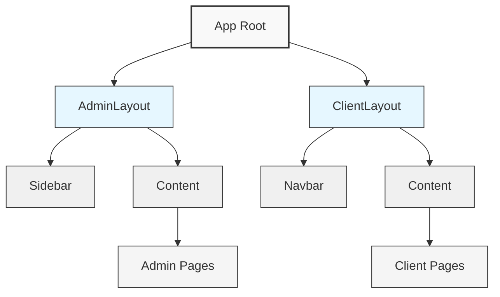
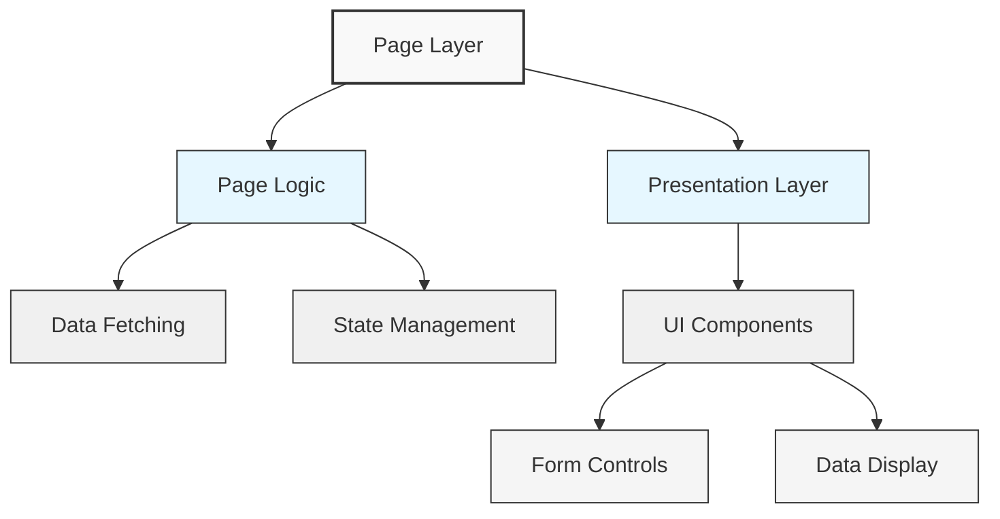
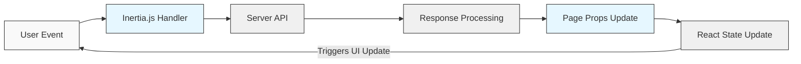
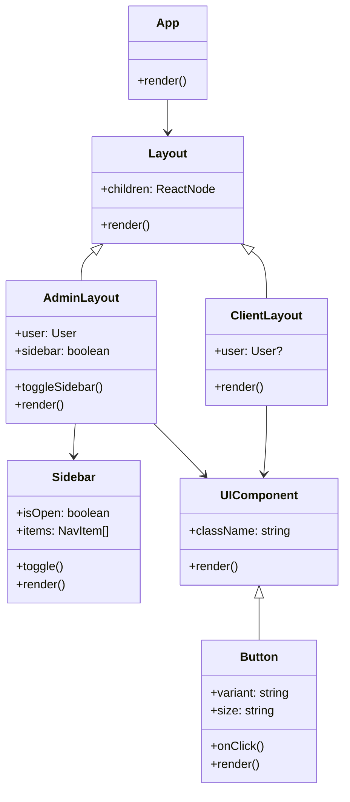

# Frontend Documentation

## Overview

This document provides a comprehensive overview of the frontend architecture for the cinema management system. The application is built using React with TypeScript, leveraging Laravel's Inertia.js for seamless client-server communication.

## Tech Stack

- **Framework**: React 19.0.0
- **Language**: TypeScript 5.7.2
- **UI Framework**: Tailwind CSS 4.1.4
- **Component Libraries**:
    - Radix UI (for accessible UI components)
    - Headless UI 2.2.0
    - Lucide React (for icons)
    - Heroicons 2.2.0
- **State Management**: Inertia.js with React
- **Routing**: Inertia.js with Laravel backend routes
- **Charts & Visualizations**: Recharts 2.15.3, Chart.js 4.4.9
- **Date Handling**: date-fns 4.1.0
- **Animation**: Framer Motion 12.7.4

## Architecture

The frontend follows a component-based architecture with clear separation of concerns:

```
resources/
├── js/
│   ├── app.tsx                  # Main entry point
│   ├── ssr.tsx                  # Server-side rendering setup
│   ├── components/              # Reusable UI components
│   │   ├── ui/                  # Generic UI components
│   │   └── ...                  # Domain-specific components
│   ├── pages/                   # Page components
│   │   ├── Admin/               # Admin area pages
│   │   ├── Client/              # Client-facing pages
│   │   └── auth/                # Authentication pages
│   ├── layouts/                 # Layout components
│   │   ├── AdminLayout.tsx      # Admin area layout
│   │   ├── ClientLayout.tsx     # Client area layout
│   │   └── ...                  # Other layouts
│   ├── hooks/                   # Custom React hooks
│   ├── utils/                   # Utility functions
│   ├── types/                   # TypeScript type definitions
│   └── lib/                     # Shared libraries and constants
├── css/
│   └── app.css                  # Global styles
└── views/                       # Laravel views for Inertia
```

## Component Structure

### Core Layout Components

- **AdminLayout**: Main layout for administrative interfaces
- **ClientLayout**: Main layout for customer-facing interfaces
- **AppLayout**: Base layout shared between different sections

### UI Components

The application uses a comprehensive set of UI components built on Radix UI primitives:

- **Button**: Multi-variant button component
- **Card**: Container component for content grouping
- **Dialog**: Modal dialog component
- **Input**: Form input component
- **Avatar**: User avatar component
- **Dropdown**: Dropdown menu component
- **Navigation**: Navigation menu component
- **Pagination**: Page navigation component
- **Tooltip**: Contextual help component
- **Sidebar**: Collapsible sidebar navigation

### Page Structure

#### Admin Section

The admin section follows a dashboard pattern with these main areas:

- **Dashboard**: Overview statistics and quick access
- **Films**: Film management (CRUD operations)
- **Screenings**: Screening schedule management
- **Reservations**: Booking management and tracking
- **Reports**: Analytics and reporting dashboards
- **Settings**: Application configuration

#### Client Section

The client-facing section follows a content-first approach:

- **Welcome**: Landing page with featured content
- **Films**: Film catalog and details
- **Reservations**: Booking management
- **Account**: User profile and settings

## Authentication Flow

The application uses Laravel's authentication system with Inertia.js integration:

1. User navigates to login/register page
2. Credentials are submitted via Inertia forms
3. Laravel handles authentication on the server
4. User state is stored in the Inertia page props
5. UI adapts based on authentication state

## Theme System

The application includes a theme system with light/dark mode support using the `use-appearance` hook:

- Theme preference is stored in localStorage
- Theme can be toggled via the UI
- System preference can be detected and applied
- Theme changes trigger DOM updates for immediate feedback

## UML Diagrams

### Component Hierarchy Diagram



### Page Component Diagram



### State Management Flow



### Component Class Diagram



## Key Files and Their Responsibilities

### Core Files

- **app.tsx**: Application entry point, sets up Inertia.js integration
- **AdminLayout.tsx**: Main layout for admin interfaces, handles navigation and user context
- **ClientLayout.tsx**: Main layout for client interfaces, handles public navigation

## Best Practices

The frontend codebase follows these best practices:

1. **TypeScript** for type safety and improved developer experience
2. **Component composition** for reusable UI elements
3. **Custom hooks** for shared behavior
4. **Consistent naming conventions**
5. **Accessibility** through Radix UI primitives
6. **Responsive design** with Tailwind CSS
7. **Performance optimization** through code splitting

## Conclusion

The frontend architecture provides a robust foundation for the cinema management system with a focus on maintainability, performance, and user experience. The component-based structure allows for easy extension and modification as requirements evolve.

# OMDb API Integration for Films

The system supports importing film data directly from the OMDb API (Open Movie Database). This feature allows administrators to easily add films to the system by searching for existing films and importing their data.

## Setup

1. Obtain an API key from [OMDb API](https://www.omdbapi.com/apikey.aspx)
2. Add your API key to the `.env` file:
    ```
    OMDB_API_KEY=your_api_key_here
    ```

## Using the Feature

Administrators can access this feature in the admin panel under the "Films" section:

1. Go to `/admin/films/create`
2. Click on the "Import from OMDB" tab
3. Enter a search term in the search field and click "Search"
4. From the search results, you can:
    - Click "Fill Form" to populate the manual creation form with data from OMDb
    - Click "Import" to directly import the film to your database

## Available Data

The following data is imported from OMDb:

- Title
- Description (Plot)
- Director
- Duration (Runtime)
- Genre
- Release Date
- Poster Image (URL)

## Limitations

- Films are checked for duplicates by title only
- Runtime is converted from the format "123 min" to minutes as an integer
- If a film's poster is listed as "N/A", it will be imported without a poster
- OMDb API has rate limits that might apply depending on your subscription level
