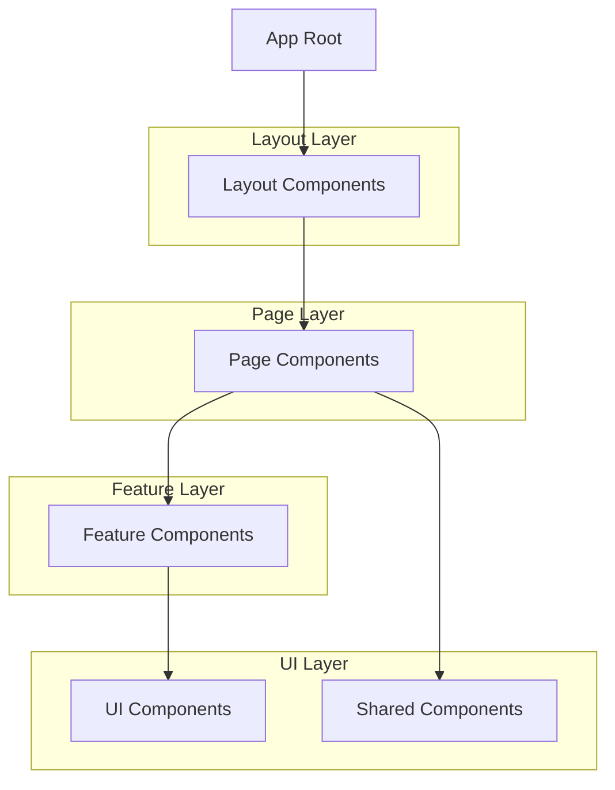
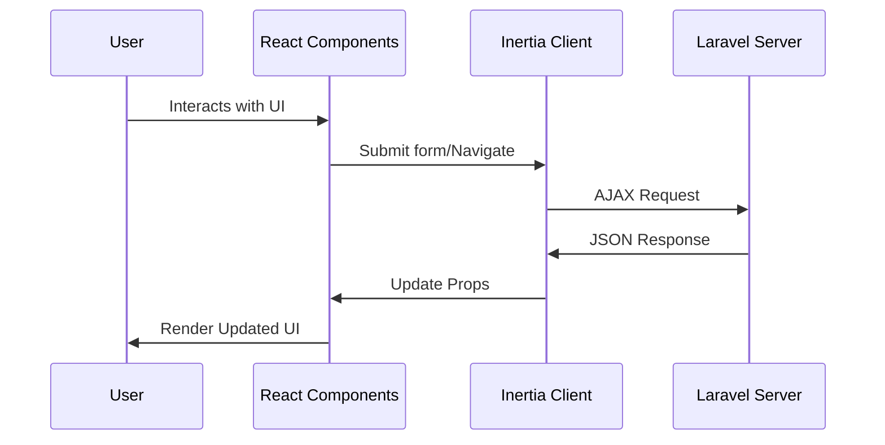
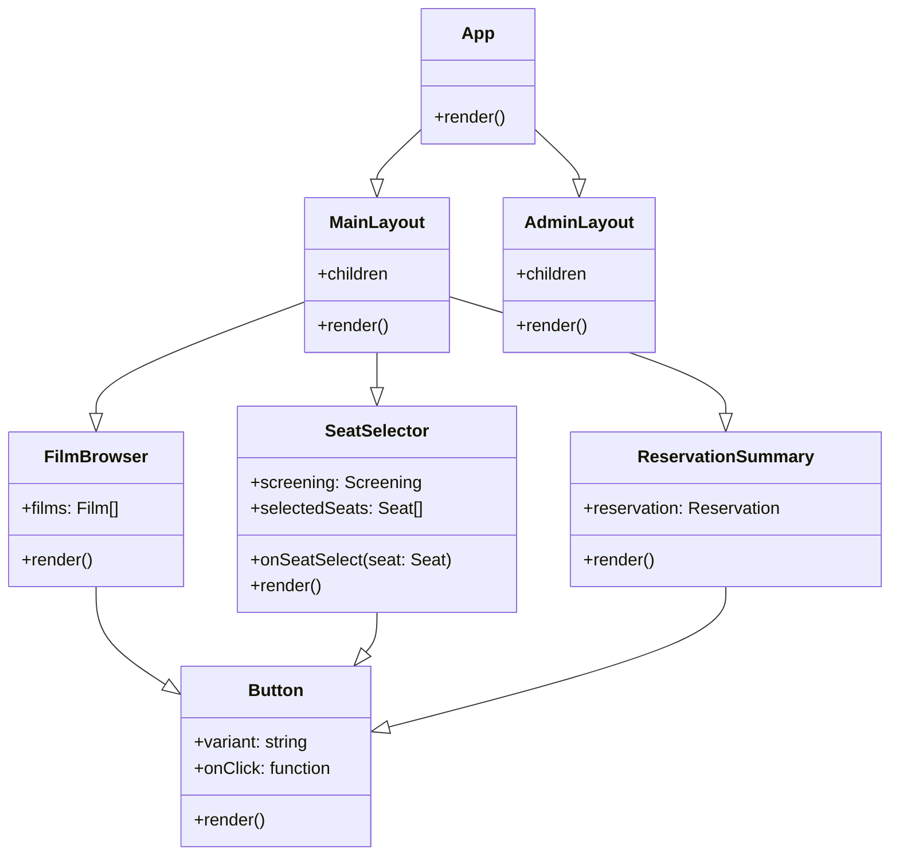
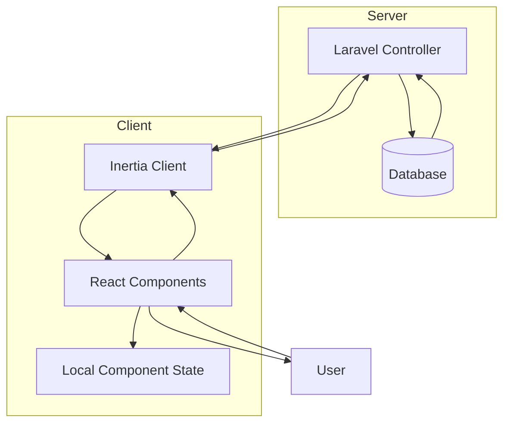
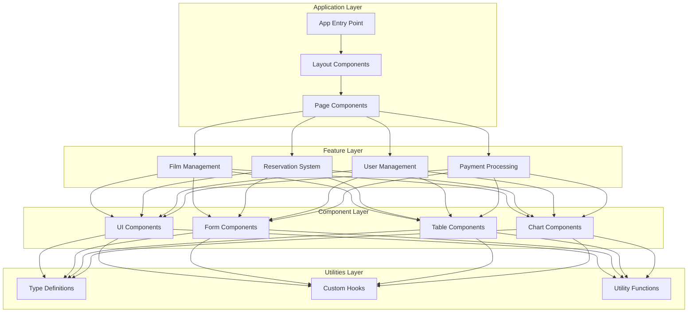

# Frontend Documentation

## Overview

The frontend of the Cinema System Management application is built using React, TypeScript, and Inertia.js. This document details the architecture, structure, and implementation patterns used in the frontend codebase.

## Technologies Used

- **React 19**: JavaScript library for building user interfaces
- **TypeScript**: Statically typed superset of JavaScript
- **Inertia.js**: Library for creating single-page applications without building an API
- **Tailwind CSS 4**: Utility-first CSS framework
- **Radix UI**: Unstyled, accessible component primitives
- **Headless UI**: Completely unstyled, fully accessible UI components
- **Framer Motion**: Animation library for React
- **Chart.js/Recharts**: Charting libraries for data visualization
- **React Leaflet**: React components for Leaflet maps

## Folder Structure

```
resources/js/
├── app.tsx                   # Main application entry point
├── ssr.tsx                   # Server-side rendering configuration
├── components/               # Reusable UI components
│   ├── ui/                   # Base UI components (buttons, inputs, etc.)
│   └── [feature]/            # Feature-specific components
├── data/                     # Data fetching utilities and constants
├── hooks/                    # Custom React hooks
├── layouts/                  # Page layout components
├── lib/                      # Utility libraries and functions
├── pages/                    # Page components (mapped to routes)
│   ├── Admin/                # Admin panel pages
│   ├── Client/               # Client-facing pages
│   ├── auth/                 # Authentication pages
│   └── settings/             # User/admin settings pages
├── types/                    # TypeScript type definitions
└── utils/                    # Utility functions
```

## Component Hierarchy

The frontend follows a component-based architecture with clear separation of concerns:



### Key Component Types

1. **Layout Components**: Define the overall structure of pages

    - `MainLayout.tsx`: Primary layout for client pages
    - `AdminLayout.tsx`: Layout for admin dashboard pages
    - `AuthLayout.tsx`: Layout for authentication pages

2. **Page Components**: Correspond to routes and serve as containers for feature components

    - Located in the `pages/` directory
    - Receive data from the backend via Inertia.js props

3. **Feature Components**: Implement specific features or business logic

    - `SeatSelection.tsx`: Seat selection interface
    - `FilmCard.tsx`: Film display component
    - `ReservationSummary.tsx`: Reservation details component

4. **UI Components**: Basic, reusable interface elements
    - Buttons, forms, modals, inputs, etc.
    - Located in `components/ui/`

## State Management

The application uses a combination of state management approaches:

1. **Server State**:

    - Primary data comes from the server via Inertia.js props
    - Server state is considered the source of truth
    - Updated through Inertia form submissions and visits

2. **Local Component State**:

    - `useState` for component-specific state
    - Used for UI state, form inputs, temporary data

3. **React Context**:

    - Used for theme settings and global UI state
    - Implemented through custom hooks (e.g., `useAppearance`)

4. **URL State**:
    - Query parameters for searchable/filterable content
    - Managed through Inertia.js navigation

## Data Flow



## Inertia.js Integration

Inertia.js serves as the bridge between the React frontend and Laravel backend:

### Initialization

The application is initialized in `app.tsx`:

```typescript
createInertiaApp({
    title: (title) => `${title} - ${appName}`,
    resolve: (name) => resolvePageComponent(`./pages/${name}.tsx`, import.meta.glob('./pages/**/*.tsx')),
    setup({ el, App, props }) {
        const root = createRoot(el);
        root.render(<App {...props} />);
    },
    progress: {
        color: '#4B5563',
    },
});
```

### Data Fetching

Data is provided to components as props from the server:

```typescript
// Example page component receiving props from Laravel
export default function Dashboard({ totalReservations, recentBookings }) {
    return (
        // Component using the data from props
    );
}
```

### Form Handling

Forms are handled using Inertia.js form helpers:

```typescript
import { useForm } from '@inertiajs/react';

export default function LoginForm() {
    const { data, setData, post, processing, errors } = useForm({
        email: '',
        password: '',
        remember: false,
    });

    function submit(e) {
        e.preventDefault();
        post(route('login'));
    }

    return (
        <form onSubmit={submit}>
            {/* Form fields */}
        </form>
    );
}
```

## TypeScript Integration

TypeScript is used throughout the application to provide type safety:

### Type Definitions

Types for backend data are defined in the `types/` directory:

```typescript
// Example type definition for a Film
interface Film {
    id: number;
    title: string;
    description: string;
    duration: number;
    release_date: string;
    poster_url?: string;
    created_at: string;
    updated_at: string;
}
```

### Prop Types

Components use TypeScript interfaces for prop validation:

```typescript
interface FilmCardProps {
    film: Film;
    showActions?: boolean;
    onSelectFilm?: (film: Film) => void;
}

export default function FilmCard({ film, showActions = true, onSelectFilm }: FilmCardProps) {
    // Component implementation
}
```

### Inertia Page Props

Type definitions for Inertia.js page props:

```typescript
// Define page props type
interface DashboardProps {
    totalReservations: number;
    recentBookings: Reservation[];
    auth: {
        user: User;
    };
}

// Use the type with the page component
export default function Dashboard({ totalReservations, recentBookings, auth }: DashboardProps) {
    // Component implementation
}
```

## Routing System

Routing is handled by Laravel on the server side, with Inertia.js managing client-side navigation:

1. **Route Definitions**: Defined in Laravel's route files
2. **Client-side Navigation**: Managed by Inertia.js's `Link` component and `visit` function
3. **Route Generation**: Uses Ziggy.js to generate route URLs from route names

```typescript
import { Link } from '@inertiajs/react';

// Using Link component for navigation
<Link href={route('films.show', { id: film.id })}>
    View Details
</Link>

// Using visit function for programmatic navigation
import { router } from '@inertiajs/react';

function navigateToFilm(filmId) {
    router.visit(route('films.show', { id: filmId }));
}
```

## UML Diagrams

### Component Relationship Diagram



### Data Flow Diagram



### Frontend Architecture



## Best Practices

1. **Component Organization**:

    - Keep components small and focused on a single responsibility
    - Use composition over inheritance
    - Implement consistent naming conventions

2. **TypeScript Usage**:

    - Define interfaces for all component props
    - Use type inference where possible
    - Avoid using `any` type
    - Create reusable type definitions for shared data structures

3. **State Management**:

    - Keep state as close to where it's used as possible
    - Lift state up only when necessary
    - Use server state (via Inertia.js props) as the source of truth
    - Use local state for UI-specific concerns

4. **Performance Optimization**:

    - Use React's memo and useMemo for expensive calculations
    - Implement virtualization for long lists
    - Optimize images and assets
    - Lazy-load components when appropriate

5. **Accessibility**:

    - Use semantic HTML elements
    - Ensure proper keyboard navigation
    - Implement ARIA attributes when necessary
    - Test with screen readers

6. **Code Splitting**:
    - Use dynamic imports for routes
    - Split code by feature
    - Implement lazy loading for large components

This documentation provides a comprehensive overview of the frontend architecture of the Cinema System Management application. It details the structure, patterns, and best practices used in the codebase to help developers understand and contribute to the project effectively.
