# Sequence Diagrams

This document provides detailed sequence diagrams for all major workflows in the cinema management system, illustrating the interactions between different components.

## Table of Contents

1. [User Authentication Flows](#user-authentication-flows)
   - [User Registration](#user-registration)
   - [User Login](#user-login)
   - [Admin Login](#admin-login)
   - [Password Reset](#password-reset)

2. [Film Management Flows](#film-management-flows)
   - [Create Film (Admin)](#create-film-admin)
   - [Update Film (Admin)](#update-film-admin)
   - [View Film Details (Client)](#view-film-details-client)

3. [Screening Management Flows](#screening-management-flows)
   - [Create Screening (Admin)](#create-screening-admin)
   - [Update Screening (Admin)](#update-screening-admin)
   - [View Film Screenings (Client)](#view-film-screenings-client)

4. [Reservation Flows](#reservation-flows)
   - [Seat Selection & Reservation Creation](#seat-selection--reservation-creation)
   - [Payment Processing](#payment-processing)
   - [Ticket Confirmation](#ticket-confirmation)
   - [Ticket Download](#ticket-download)

5. [Admin Dashboard Flows](#admin-dashboard-flows)
   - [Load Dashboard Stats](#load-dashboard-stats)
   - [View Reports](#view-reports)
   - [Manage Reservations](#manage-reservations)

6. [User Account Flows](#user-account-flows)
   - [View Reservation History](#view-reservation-history)
   - [Update Profile](#update-profile)
   - [Change Password](#change-password)

---

## User Authentication Flows

### User Registration

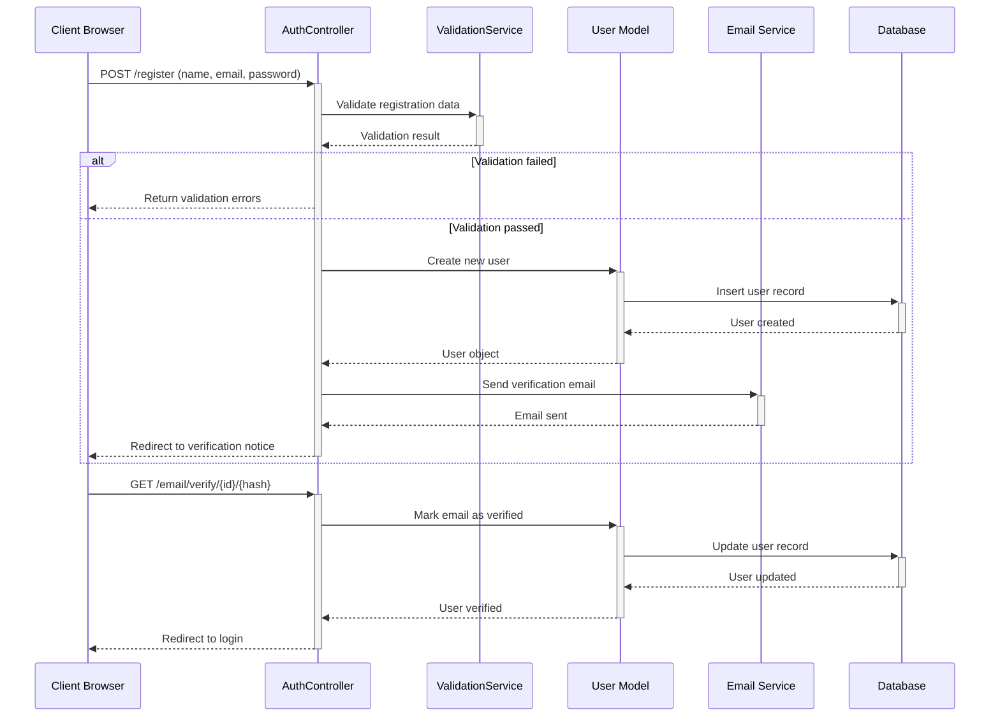
```mermaid
sequenceDiagram
    participant Client as Client Browser
    participant Controller as AuthController
    participant Validator as ValidationService
    participant User as User Model
    participant Mailer as Email Service
    participant DB as Database

    Client->>+Controller: POST /register (name, email, password)
    Controller->>+Validator: Validate registration data
    Validator-->>-Controller: Validation result

    alt Validation failed
        Controller-->>Client: Return validation errors
    else Validation passed
        Controller->>+User: Create new user
        User->>+DB: Insert user record
        DB-->>-User: User created
        User-->>-Controller: User object

        Controller->>+Mailer: Send verification email
        Mailer-->>-Controller: Email sent

        Controller-->>-Client: Redirect to verification notice
    end

    Client->>+Controller: GET /email/verify/{id}/{hash}
    Controller->>+User: Mark email as verified
    User->>+DB: Update user record
    DB-->>-User: User updated
    User-->>-Controller: User verified
    Controller-->>-Client: Redirect to login
```

### User Login

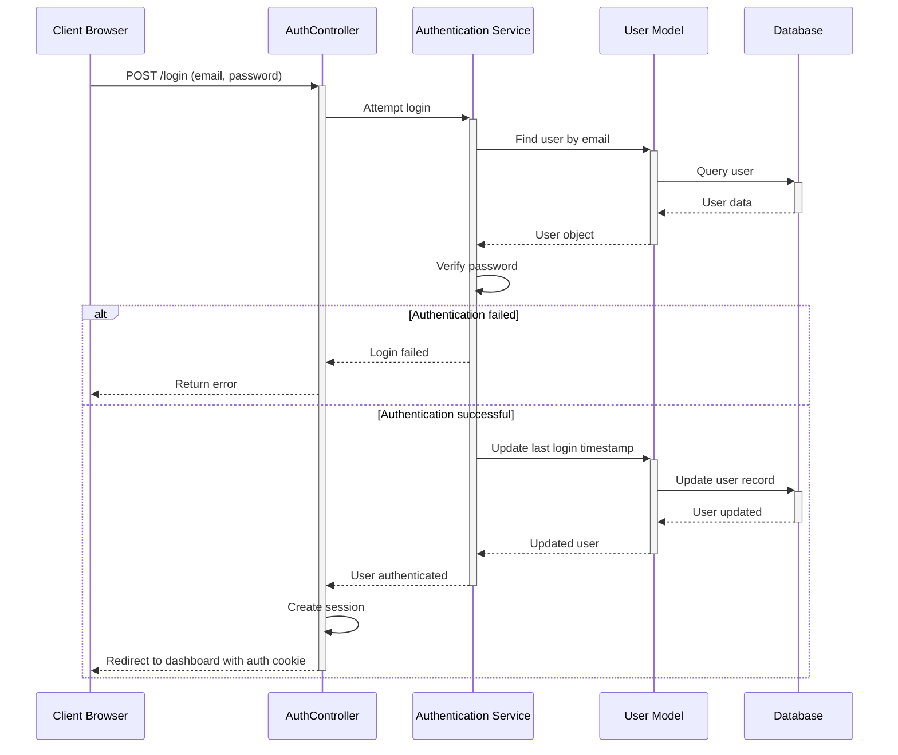
```mermaid
sequenceDiagram
    participant Client as Client Browser
    participant Controller as AuthController
    participant Auth as Authentication Service
    participant User as User Model
    participant DB as Database

    Client->>+Controller: POST /login (email, password)
    Controller->>+Auth: Attempt login
    Auth->>+User: Find user by email
    User->>+DB: Query user
    DB-->>-User: User data
    User-->>-Auth: User object

    Auth->>Auth: Verify password

    alt Authentication failed
        Auth-->>Controller: Login failed
        Controller-->>Client: Return error
    else Authentication successful
        Auth->>+User: Update last login timestamp
        User->>+DB: Update user record
        DB-->>-User: User updated
        User-->>-Auth: Updated user

        Auth-->>-Controller: User authenticated
        Controller->>Controller: Create session
        Controller-->>-Client: Redirect to dashboard with auth cookie
    end
```

### Admin Login

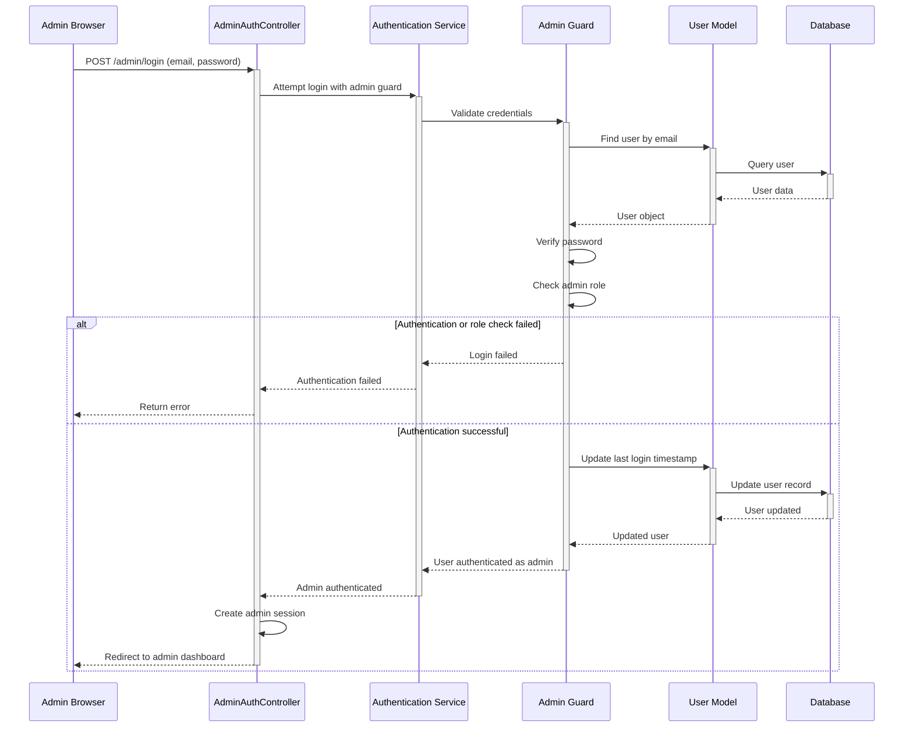
```mermaid
sequenceDiagram
    participant Client as Admin Browser
    participant Controller as AdminAuthController
    participant Auth as Authentication Service
    participant Guard as Admin Guard
    participant User as User Model
    participant DB as Database

    Client->>+Controller: POST /admin/login (email, password)
    Controller->>+Auth: Attempt login with admin guard
    Auth->>+Guard: Validate credentials
    Guard->>+User: Find user by email
    User->>+DB: Query user
    DB-->>-User: User data
    User-->>-Guard: User object

    Guard->>Guard: Verify password
    Guard->>Guard: Check admin role

    alt Authentication or role check failed
        Guard-->>Auth: Login failed
        Auth-->>Controller: Authentication failed
        Controller-->>Client: Return error
    else Authentication successful
        Guard->>+User: Update last login timestamp
        User->>+DB: Update user record
        DB-->>-User: User updated
        User-->>-Guard: Updated user

        Guard-->>-Auth: User authenticated as admin
        Auth-->>-Controller: Admin authenticated
        Controller->>Controller: Create admin session
        Controller-->>-Client: Redirect to admin dashboard
    end
```

### Password Reset

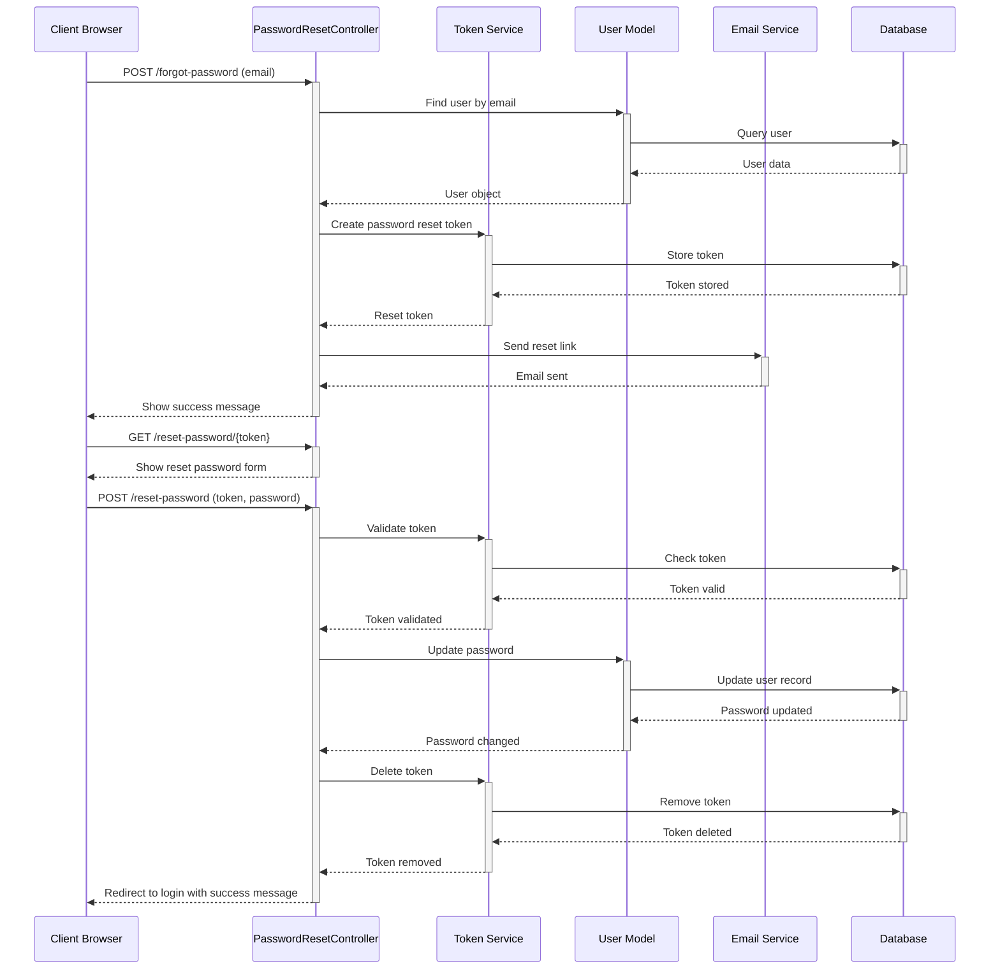
```mermaid
sequenceDiagram
    participant Client as Client Browser
    participant Controller as PasswordResetController
    participant Token as Token Service
    participant User as User Model
    participant Mailer as Email Service
    participant DB as Database

    Client->>+Controller: POST /forgot-password (email)
    Controller->>+User: Find user by email
    User->>+DB: Query user
    DB-->>-User: User data
    User-->>-Controller: User object

    Controller->>+Token: Create password reset token
    Token->>+DB: Store token
    DB-->>-Token: Token stored
    Token-->>-Controller: Reset token

    Controller->>+Mailer: Send reset link
    Mailer-->>-Controller: Email sent

    Controller-->>-Client: Show success message

    Client->>+Controller: GET /reset-password/{token}
    Controller-->>-Client: Show reset password form

    Client->>+Controller: POST /reset-password (token, password)
    Controller->>+Token: Validate token
    Token->>+DB: Check token
    DB-->>-Token: Token valid
    Token-->>-Controller: Token validated

    Controller->>+User: Update password
    User->>+DB: Update user record
    DB-->>-User: Password updated
    User-->>-Controller: Password changed

    Controller->>+Token: Delete token
    Token->>+DB: Remove token
    DB-->>-Token: Token deleted
    Token-->>-Controller: Token removed

    Controller-->>-Client: Redirect to login with success message
```

---

## Film Management Flows

### Create Film (Admin)

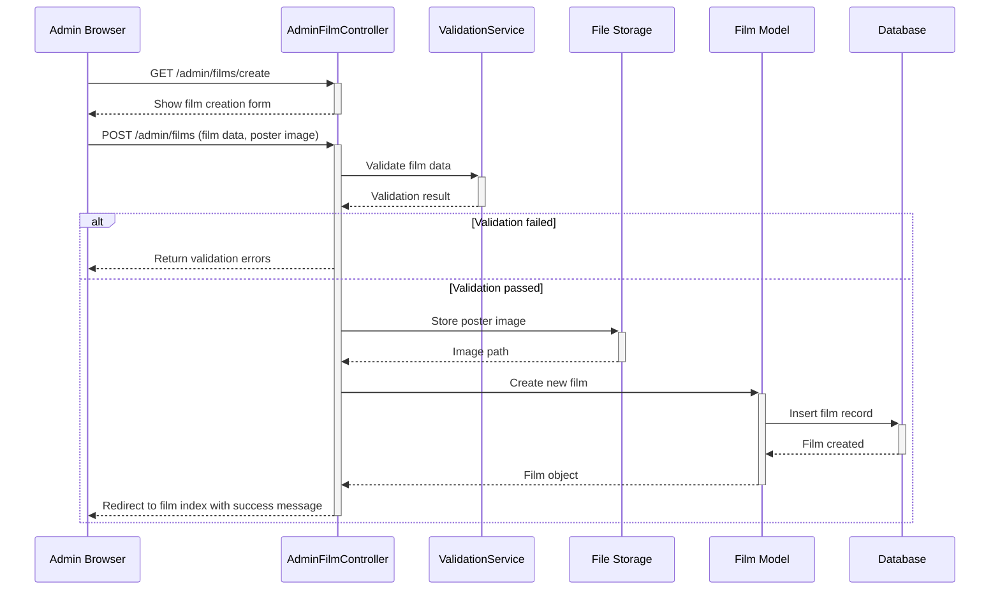
```mermaid
sequenceDiagram
    participant Admin as Admin Browser
    participant Controller as AdminFilmController
    participant Validator as ValidationService
    participant Storage as File Storage
    participant Film as Film Model
    participant DB as Database

    Admin->>+Controller: GET /admin/films/create
    Controller-->>-Admin: Show film creation form

    Admin->>+Controller: POST /admin/films (film data, poster image)
    Controller->>+Validator: Validate film data
    Validator-->>-Controller: Validation result

    alt Validation failed
        Controller-->>Admin: Return validation errors
    else Validation passed
        Controller->>+Storage: Store poster image
        Storage-->>-Controller: Image path

        Controller->>+Film: Create new film
        Film->>+DB: Insert film record
        DB-->>-Film: Film created
        Film-->>-Controller: Film object

        Controller-->>-Admin: Redirect to film index with success message
    end
```

### Update Film (Admin)

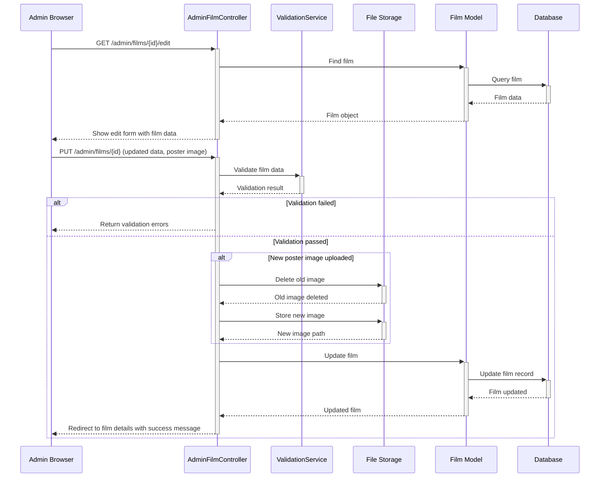
```mermaid
sequenceDiagram
    participant Admin as Admin Browser
    participant Controller as AdminFilmController
    participant Validator as ValidationService
    participant Storage as File Storage
    participant Film as Film Model
    participant DB as Database

    Admin->>+Controller: GET /admin/films/{id}/edit
    Controller->>+Film: Find film
    Film->>+DB: Query film
    DB-->>-Film: Film data
    Film-->>-Controller: Film object
    Controller-->>-Admin: Show edit form with film data

    Admin->>+Controller: PUT /admin/films/{id} (updated data, poster image)
    Controller->>+Validator: Validate film data
    Validator-->>-Controller: Validation result

    alt Validation failed
        Controller-->>Admin: Return validation errors
    else Validation passed
        alt New poster image uploaded
            Controller->>+Storage: Delete old image
            Storage-->>-Controller: Old image deleted

            Controller->>+Storage: Store new image
            Storage-->>-Controller: New image path
        end

        Controller->>+Film: Update film
        Film->>+DB: Update film record
        DB-->>-Film: Film updated
        Film-->>-Controller: Updated film

        Controller-->>-Admin: Redirect to film details with success message
    end
```

### View Film Details (Client)

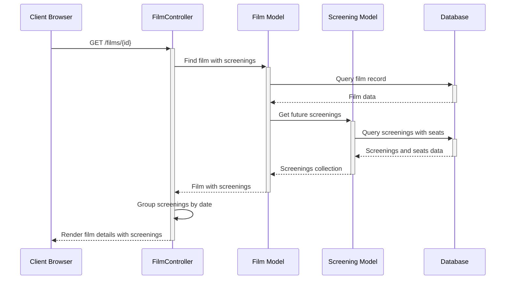
```mermaid
sequenceDiagram
    participant Client as Client Browser
    participant Controller as FilmController
    participant Film as Film Model
    participant Screening as Screening Model
    participant DB as Database

    Client->>+Controller: GET /films/{id}
    Controller->>+Film: Find film with screenings
    Film->>+DB: Query film record
    DB-->>-Film: Film data

    Film->>+Screening: Get future screenings
    Screening->>+DB: Query screenings with seats
    DB-->>-Screening: Screenings and seats data
    Screening-->>-Film: Screenings collection

    Film-->>-Controller: Film with screenings

    Controller->>Controller: Group screenings by date
    Controller-->>-Client: Render film details with screenings
```

---

## Screening Management Flows

### Create Screening (Admin)

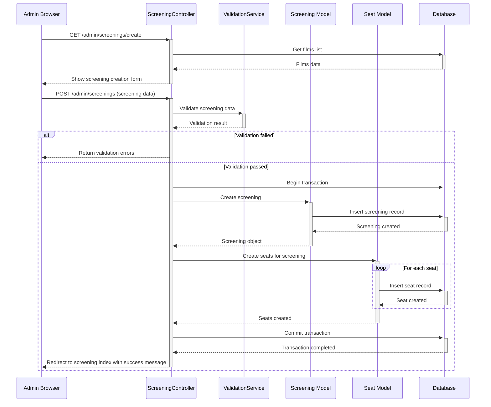
```mermaid
sequenceDiagram
    participant Admin as Admin Browser
    participant Controller as ScreeningController
    participant Validator as ValidationService
    participant Screening as Screening Model
    participant Seat as Seat Model
    participant DB as Database

    Admin->>+Controller: GET /admin/screenings/create
    Controller->>+DB: Get films list
    DB-->>-Controller: Films data
    Controller-->>-Admin: Show screening creation form

    Admin->>+Controller: POST /admin/screenings (screening data)
    Controller->>+Validator: Validate screening data
    Validator-->>-Controller: Validation result

    alt Validation failed
        Controller-->>Admin: Return validation errors
    else Validation passed
        Controller->>+DB: Begin transaction

        Controller->>+Screening: Create screening
        Screening->>+DB: Insert screening record
        DB-->>-Screening: Screening created
        Screening-->>-Controller: Screening object

        Controller->>+Seat: Create seats for screening
        loop For each seat
            Seat->>+DB: Insert seat record
            DB-->>-Seat: Seat created
        end
        Seat-->>-Controller: Seats created

        Controller->>+DB: Commit transaction
        DB-->>-Controller: Transaction completed

        Controller-->>-Admin: Redirect to screening index with success message
    end
```

### Update Screening (Admin)

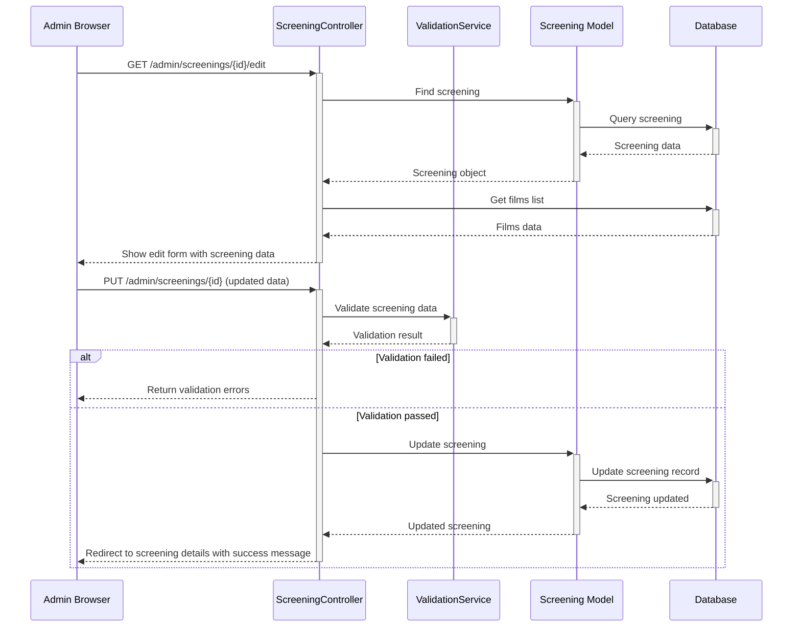
```mermaid
sequenceDiagram
    participant Admin as Admin Browser
    participant Controller as ScreeningController
    participant Validator as ValidationService
    participant Screening as Screening Model
    participant DB as Database

    Admin->>+Controller: GET /admin/screenings/{id}/edit
    Controller->>+Screening: Find screening
    Screening->>+DB: Query screening
    DB-->>-Screening: Screening data
    Screening-->>-Controller: Screening object

    Controller->>+DB: Get films list
    DB-->>-Controller: Films data
    Controller-->>-Admin: Show edit form with screening data

    Admin->>+Controller: PUT /admin/screenings/{id} (updated data)
    Controller->>+Validator: Validate screening data
    Validator-->>-Controller: Validation result

    alt Validation failed
        Controller-->>Admin: Return validation errors
    else Validation passed
        Controller->>+Screening: Update screening
        Screening->>+DB: Update screening record
        DB-->>-Screening: Screening updated
        Screening-->>-Controller: Updated screening

        Controller-->>-Admin: Redirect to screening details with success message
    end
```

### View Film Screenings (Client)

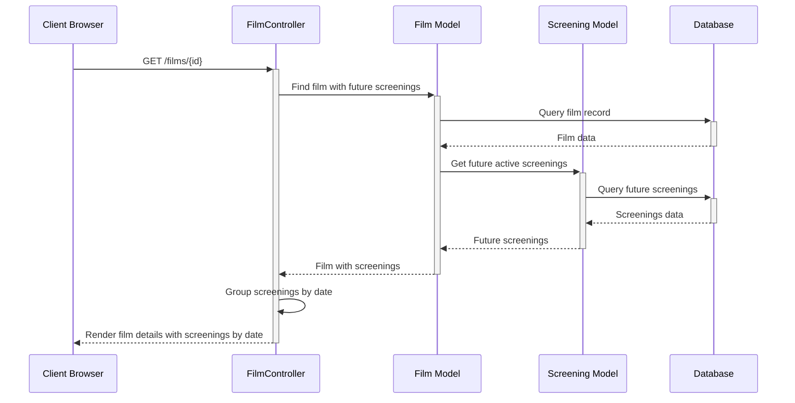
```mermaid
sequenceDiagram
    participant Client as Client Browser
    participant Controller as FilmController
    participant Film as Film Model
    participant Screening as Screening Model
    participant DB as Database

    Client->>+Controller: GET /films/{id}
    Controller->>+Film: Find film with future screenings
    Film->>+DB: Query film record
    DB-->>-Film: Film data

    Film->>+Screening: Get future active screenings
    Screening->>+DB: Query future screenings
    DB-->>-Screening: Screenings data
    Screening-->>-Film: Future screenings

    Film-->>-Controller: Film with screenings

    Controller->>Controller: Group screenings by date
    Controller-->>-Client: Render film details with screenings by date
```

---

## Reservation Flows

### Seat Selection & Reservation Creation

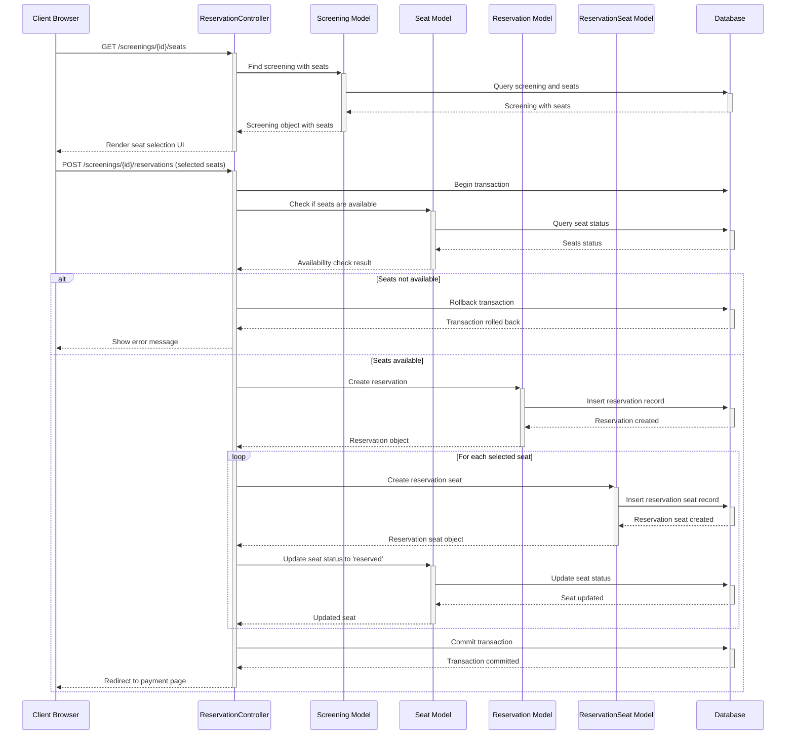
```mermaid
sequenceDiagram
    participant Client as Client Browser
    participant Controller as ReservationController
    participant Screening as Screening Model
    participant Seat as Seat Model
    participant Reservation as Reservation Model
    participant ReservationSeat as ReservationSeat Model
    participant DB as Database

    Client->>+Controller: GET /screenings/{id}/seats
    Controller->>+Screening: Find screening with seats
    Screening->>+DB: Query screening and seats
    DB-->>-Screening: Screening with seats
    Screening-->>-Controller: Screening object with seats
    Controller-->>-Client: Render seat selection UI

    Client->>+Controller: POST /screenings/{id}/reservations (selected seats)
    Controller->>+DB: Begin transaction

    Controller->>+Seat: Check if seats are available
    Seat->>+DB: Query seat status
    DB-->>-Seat: Seats status
    Seat-->>-Controller: Availability check result

    alt Seats not available
        Controller->>+DB: Rollback transaction
        DB-->>-Controller: Transaction rolled back
        Controller-->>Client: Show error message
    else Seats available
        Controller->>+Reservation: Create reservation
        Reservation->>+DB: Insert reservation record
        DB-->>-Reservation: Reservation created
        Reservation-->>-Controller: Reservation object

        loop For each selected seat
            Controller->>+ReservationSeat: Create reservation seat
            ReservationSeat->>+DB: Insert reservation seat record
            DB-->>-ReservationSeat: Reservation seat created
            ReservationSeat-->>-Controller: Reservation seat object

            Controller->>+Seat: Update seat status to 'reserved'
            Seat->>+DB: Update seat status
            DB-->>-Seat: Seat updated
            Seat-->>-Controller: Updated seat
        end

        Controller->>+DB: Commit transaction
        DB-->>-Controller: Transaction committed

        Controller-->>-Client: Redirect to payment page
    end
```

### Payment Processing

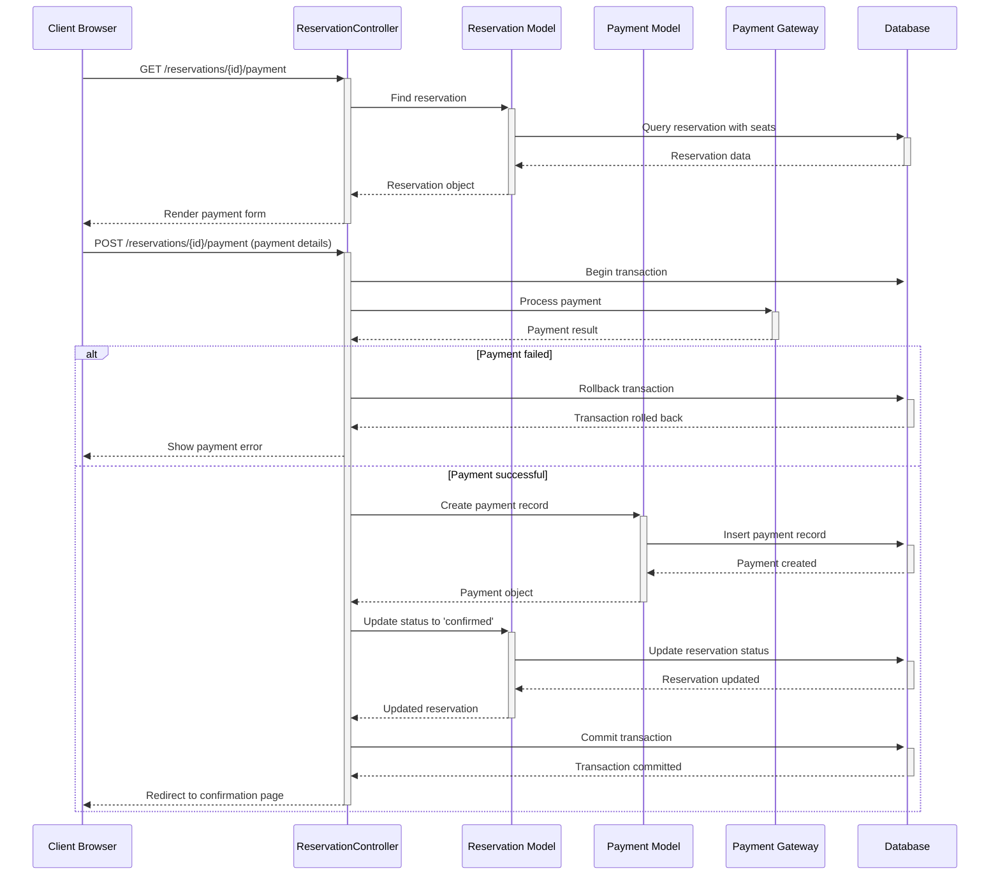
```mermaid
sequenceDiagram
    participant Client as Client Browser
    participant Controller as ReservationController
    participant Reservation as Reservation Model
    participant Payment as Payment Model
    participant PaymentGateway as Payment Gateway
    participant DB as Database

    Client->>+Controller: GET /reservations/{id}/payment
    Controller->>+Reservation: Find reservation
    Reservation->>+DB: Query reservation with seats
    DB-->>-Reservation: Reservation data
    Reservation-->>-Controller: Reservation object
    Controller-->>-Client: Render payment form

    Client->>+Controller: POST /reservations/{id}/payment (payment details)
    Controller->>+DB: Begin transaction

    Controller->>+PaymentGateway: Process payment
    PaymentGateway-->>-Controller: Payment result

    alt Payment failed
        Controller->>+DB: Rollback transaction
        DB-->>-Controller: Transaction rolled back
        Controller-->>Client: Show payment error
    else Payment successful
        Controller->>+Payment: Create payment record
        Payment->>+DB: Insert payment record
        DB-->>-Payment: Payment created
        Payment-->>-Controller: Payment object

        Controller->>+Reservation: Update status to 'confirmed'
        Reservation->>+DB: Update reservation status
        DB-->>-Reservation: Reservation updated
        Reservation-->>-Controller: Updated reservation

        Controller->>+DB: Commit transaction
        DB-->>-Controller: Transaction committed

        Controller-->>-Client: Redirect to confirmation page
    end
```

### Ticket Confirmation

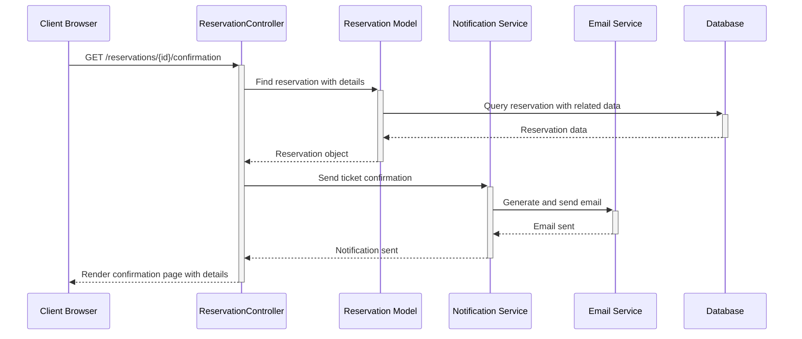
```mermaid
sequenceDiagram
    participant Client as Client Browser
    participant Controller as ReservationController
    participant Reservation as Reservation Model
    participant Notification as Notification Service
    participant Mailer as Email Service
    participant DB as Database

    Client->>+Controller: GET /reservations/{id}/confirmation
    Controller->>+Reservation: Find reservation with details
    Reservation->>+DB: Query reservation with related data
    DB-->>-Reservation: Reservation data
    Reservation-->>-Controller: Reservation object

    Controller->>+Notification: Send ticket confirmation
    Notification->>+Mailer: Generate and send email
    Mailer-->>-Notification: Email sent
    Notification-->>-Controller: Notification sent

    Controller-->>-Client: Render confirmation page with details
```

### Ticket Download

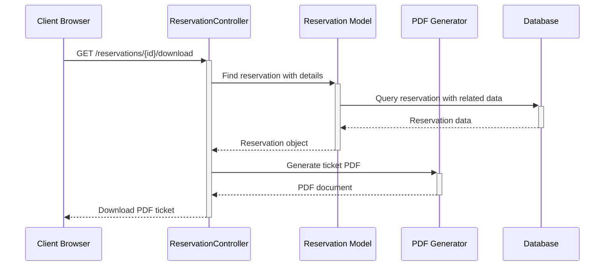
```mermaid
sequenceDiagram
    participant Client as Client Browser
    participant Controller as ReservationController
    participant Reservation as Reservation Model
    participant PDF as PDF Generator
    participant DB as Database

    Client->>+Controller: GET /reservations/{id}/download
    Controller->>+Reservation: Find reservation with details
    Reservation->>+DB: Query reservation with related data
    DB-->>-Reservation: Reservation data
    Reservation-->>-Controller: Reservation object

    Controller->>+PDF: Generate ticket PDF
    PDF-->>-Controller: PDF document

    Controller-->>-Client: Download PDF ticket
```

---

## Admin Dashboard Flows

### Load Dashboard Stats

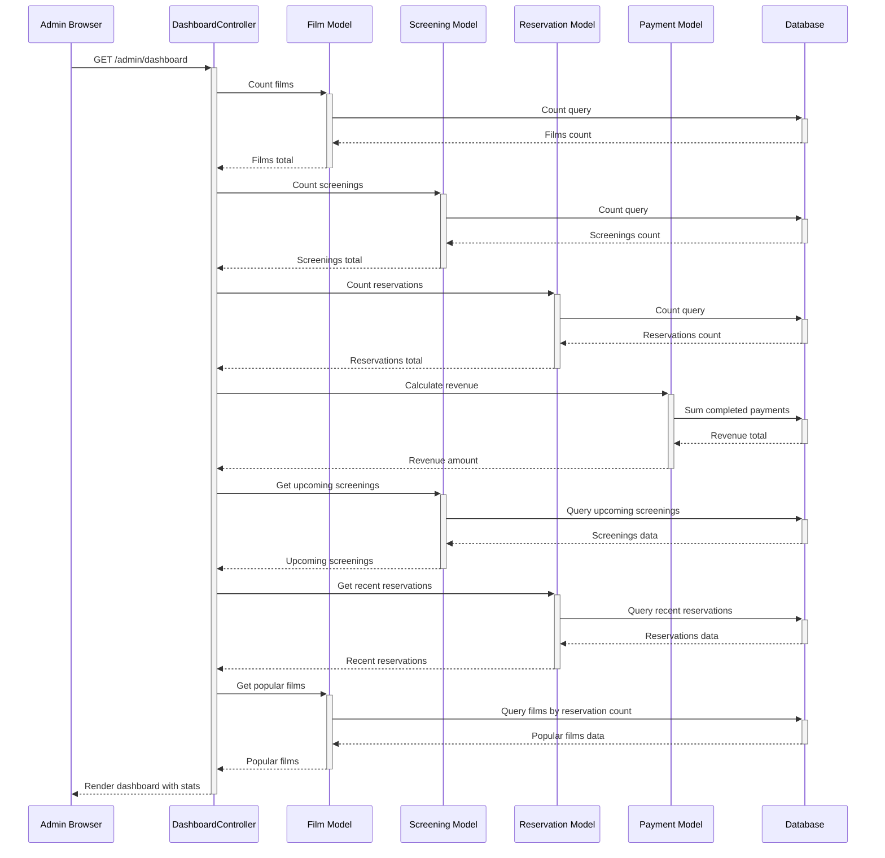
```mermaid
sequenceDiagram
    participant Admin as Admin Browser
    participant Controller as DashboardController
    participant Film as Film Model
    participant Screening as Screening Model
    participant Reservation as Reservation Model
    participant Payment as Payment Model
    participant DB as Database

    Admin->>+Controller: GET /admin/dashboard

    Controller->>+Film: Count films
    Film->>+DB: Count query
    DB-->>-Film: Films count
    Film-->>-Controller: Films total

    Controller->>+Screening: Count screenings
    Screening->>+DB: Count query
    DB-->>-Screening: Screenings count
    Screening-->>-Controller: Screenings total

    Controller->>+Reservation: Count reservations
    Reservation->>+DB: Count query
    DB-->>-Reservation: Reservations count
    Reservation-->>-Controller: Reservations total

    Controller->>+Payment: Calculate revenue
    Payment->>+DB: Sum completed payments
    DB-->>-Payment: Revenue total
    Payment-->>-Controller: Revenue amount

    Controller->>+Screening: Get upcoming screenings
    Screening->>+DB: Query upcoming screenings
    DB-->>-Screening: Screenings data
    Screening-->>-Controller: Upcoming screenings

    Controller->>+Reservation: Get recent reservations
    Reservation->>+DB: Query recent reservations
    DB-->>-Reservation: Reservations data
    Reservation-->>-Controller: Recent reservations

    Controller->>+Film: Get popular films
    Film->>+DB: Query films by reservation count
    DB-->>-Film: Popular films data
    Film-->>-Controller: Popular films

    Controller-->>-Admin: Render dashboard with stats
```

### View Reports

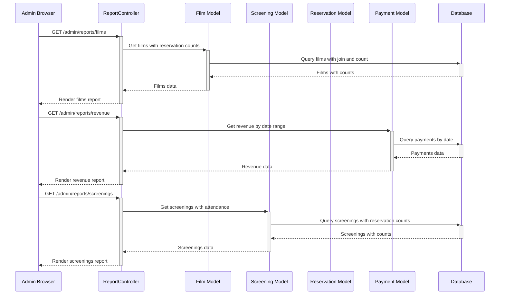
```mermaid
sequenceDiagram
    participant Admin as Admin Browser
    participant Controller as ReportController
    participant Film as Film Model
    participant Screening as Screening Model
    participant Reservation as Reservation Model
    participant Payment as Payment Model
    participant DB as Database

    Admin->>+Controller: GET /admin/reports/films
    Controller->>+Film: Get films with reservation counts
    Film->>+DB: Query films with join and count
    DB-->>-Film: Films with counts
    Film-->>-Controller: Films data
    Controller-->>-Admin: Render films report

    Admin->>+Controller: GET /admin/reports/revenue
    Controller->>+Payment: Get revenue by date range
    Payment->>+DB: Query payments by date
    DB-->>-Payment: Payments data
    Payment-->>-Controller: Revenue data
    Controller-->>-Admin: Render revenue report

    Admin->>+Controller: GET /admin/reports/screenings
    Controller->>+Screening: Get screenings with attendance
    Screening->>+DB: Query screenings with reservation counts
    DB-->>-Screening: Screenings with counts
    Screening-->>-Controller: Screenings data
    Controller-->>-Admin: Render screenings report
```

### Manage Reservations

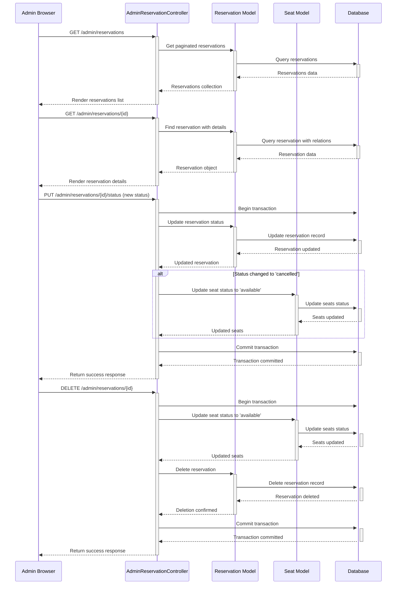
```mermaid
sequenceDiagram
    participant Admin as Admin Browser
    participant Controller as AdminReservationController
    participant Reservation as Reservation Model
    participant Seat as Seat Model
    participant DB as Database

    Admin->>+Controller: GET /admin/reservations
    Controller->>+Reservation: Get paginated reservations
    Reservation->>+DB: Query reservations
    DB-->>-Reservation: Reservations data
    Reservation-->>-Controller: Reservations collection
    Controller-->>-Admin: Render reservations list

    Admin->>+Controller: GET /admin/reservations/{id}
    Controller->>+Reservation: Find reservation with details
    Reservation->>+DB: Query reservation with relations
    DB-->>-Reservation: Reservation data
    Reservation-->>-Controller: Reservation object
    Controller-->>-Admin: Render reservation details

    Admin->>+Controller: PUT /admin/reservations/{id}/status (new status)
    Controller->>+DB: Begin transaction

    Controller->>+Reservation: Update reservation status
    Reservation->>+DB: Update reservation record
    DB-->>-Reservation: Reservation updated
    Reservation-->>-Controller: Updated reservation

    alt Status changed to 'cancelled'
        Controller->>+Seat: Update seat status to 'available'
        Seat->>+DB: Update seats status
        DB-->>-Seat: Seats updated
        Seat-->>-Controller: Updated seats
    end

    Controller->>+DB: Commit transaction
    DB-->>-Controller: Transaction committed

    Controller-->>-Admin: Return success response

    Admin->>+Controller: DELETE /admin/reservations/{id}
    Controller->>+DB: Begin transaction

    Controller->>+Seat: Update seat status to 'available'
    Seat->>+DB: Update seats status
    DB-->>-Seat: Seats updated
    Seat-->>-Controller: Updated seats

    Controller->>+Reservation: Delete reservation
    Reservation->>+DB: Delete reservation record
    DB-->>-Reservation: Reservation deleted
    Reservation-->>-Controller: Deletion confirmed

    Controller->>+DB: Commit transaction
    DB-->>-Controller: Transaction committed

    Controller-->>-Admin: Return success response
```

---

## User Account Flows

### View Reservation History

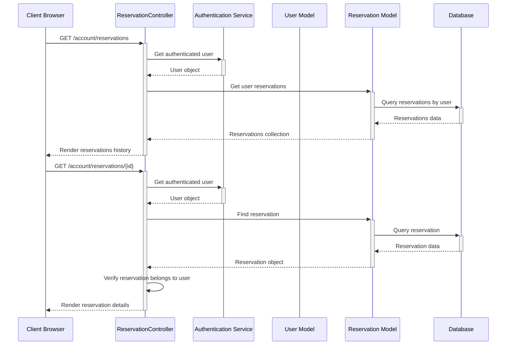
```mermaid
sequenceDiagram
    participant Client as Client Browser
    participant Controller as ReservationController
    participant Auth as Authentication Service
    participant User as User Model
    participant Reservation as Reservation Model
    participant DB as Database

    Client->>+Controller: GET /account/reservations
    Controller->>+Auth: Get authenticated user
    Auth-->>-Controller: User object

    Controller->>+Reservation: Get user reservations
    Reservation->>+DB: Query reservations by user
    DB-->>-Reservation: Reservations data
    Reservation-->>-Controller: Reservations collection

    Controller-->>-Client: Render reservations history

    Client->>+Controller: GET /account/reservations/{id}
    Controller->>+Auth: Get authenticated user
    Auth-->>-Controller: User object

    Controller->>+Reservation: Find reservation
    Reservation->>+DB: Query reservation
    DB-->>-Reservation: Reservation data
    Reservation-->>-Controller: Reservation object

    Controller->>Controller: Verify reservation belongs to user

    Controller-->>-Client: Render reservation details
```

### Update Profile

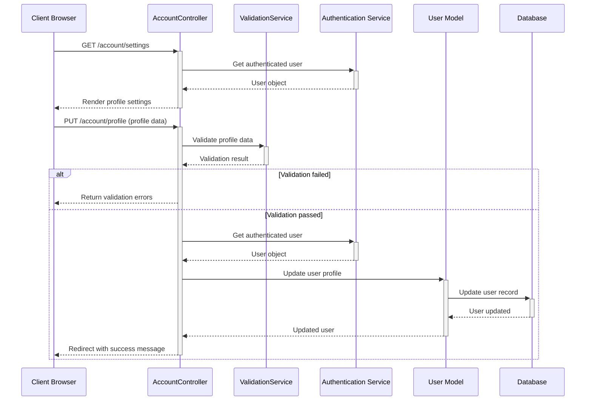
```mermaid
sequenceDiagram
    participant Client as Client Browser
    participant Controller as AccountController
    participant Validator as ValidationService
    participant Auth as Authentication Service
    participant User as User Model
    participant DB as Database

    Client->>+Controller: GET /account/settings
    Controller->>+Auth: Get authenticated user
    Auth-->>-Controller: User object
    Controller-->>-Client: Render profile settings

    Client->>+Controller: PUT /account/profile (profile data)
    Controller->>+Validator: Validate profile data
    Validator-->>-Controller: Validation result

    alt Validation failed
        Controller-->>Client: Return validation errors
    else Validation passed
        Controller->>+Auth: Get authenticated user
        Auth-->>-Controller: User object

        Controller->>+User: Update user profile
        User->>+DB: Update user record
        DB-->>-User: User updated
        User-->>-Controller: Updated user

        Controller-->>-Client: Redirect with success message
    end
```

### Change Password

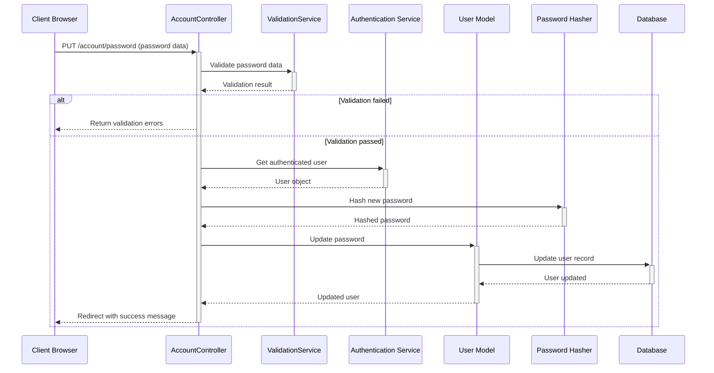
```mermaid
sequenceDiagram
    participant Client as Client Browser
    participant Controller as AccountController
    participant Validator as ValidationService
    participant Auth as Authentication Service
    participant User as User Model
    participant Hash as Password Hasher
    participant DB as Database

    Client->>+Controller: PUT /account/password (password data)
    Controller->>+Validator: Validate password data
    Validator-->>-Controller: Validation result

    alt Validation failed
        Controller-->>Client: Return validation errors
    else Validation passed
        Controller->>+Auth: Get authenticated user
        Auth-->>-Controller: User object

        Controller->>+Hash: Hash new password
        Hash-->>-Controller: Hashed password

        Controller->>+User: Update password
        User->>+DB: Update user record
        DB-->>-User: User updated
        User-->>-Controller: Updated user

        Controller-->>-Client: Redirect with success message
    end
```
