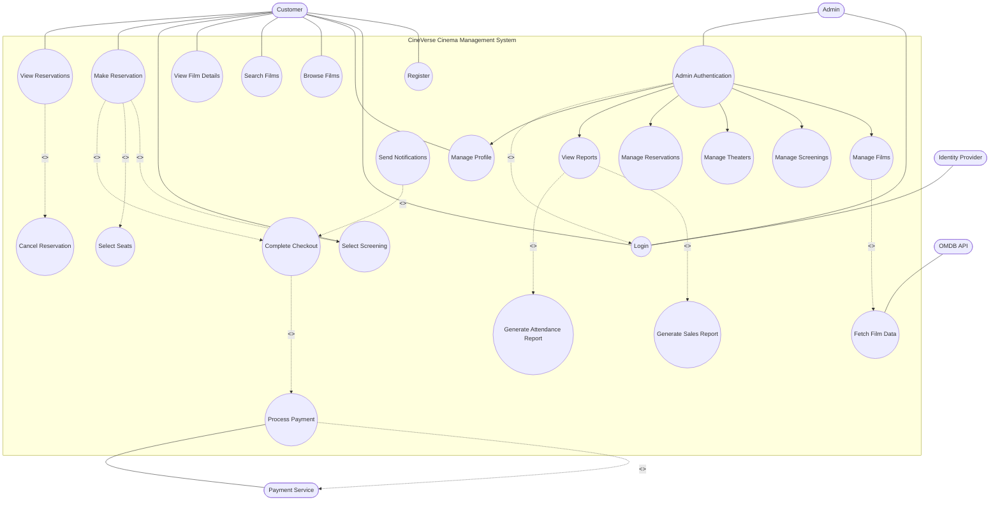
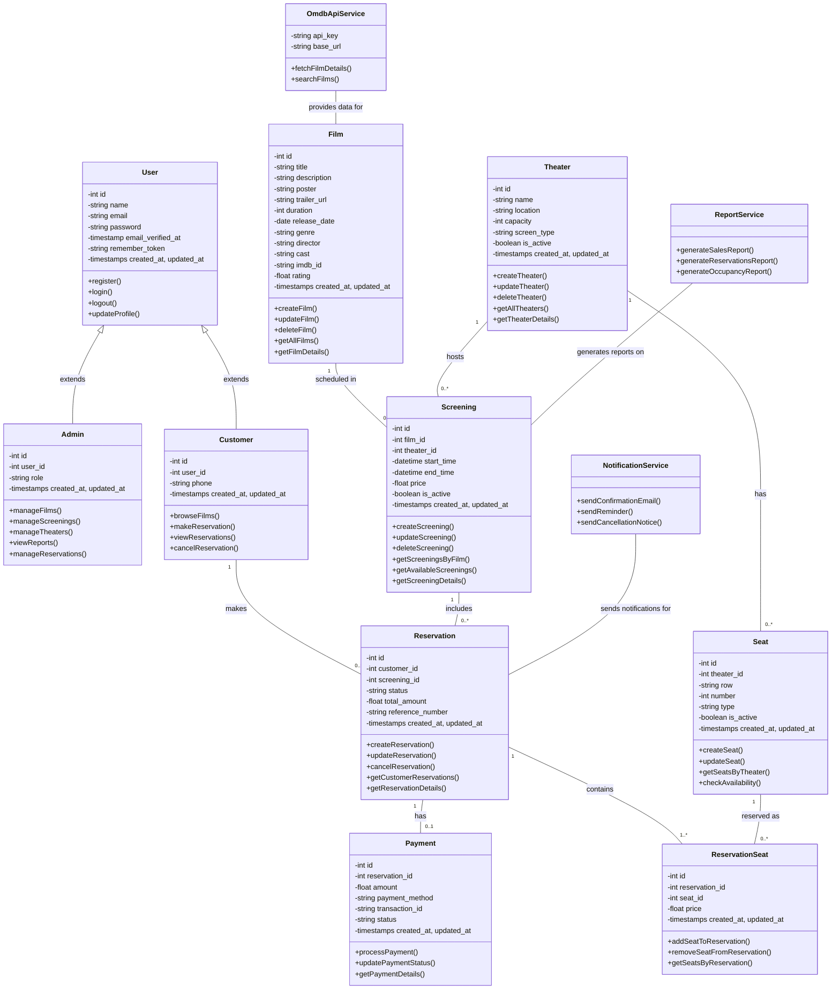
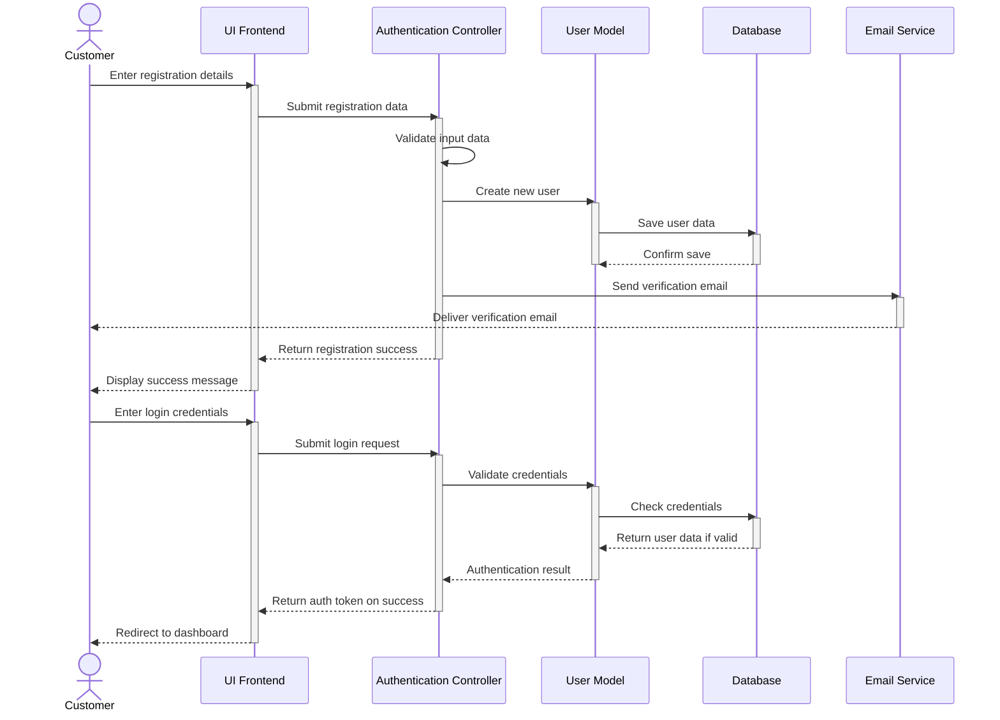
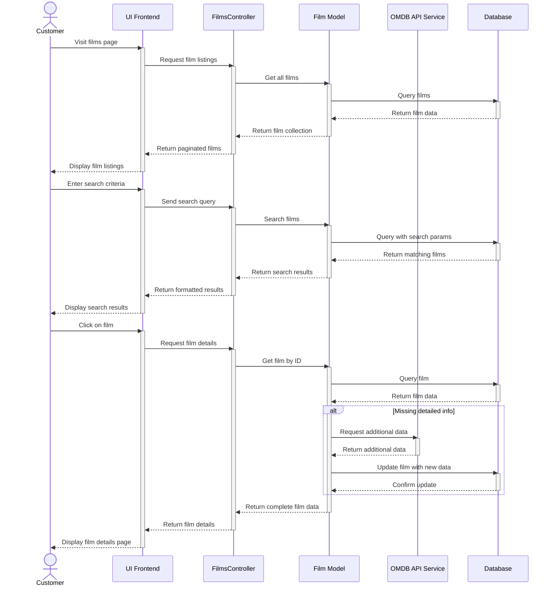
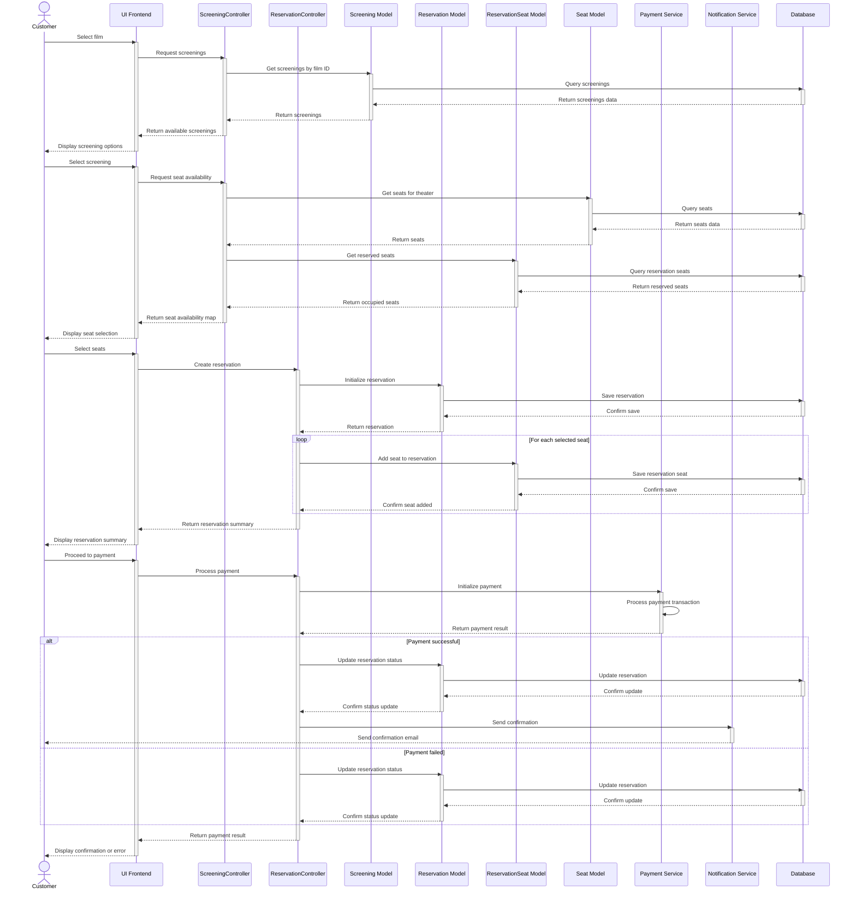
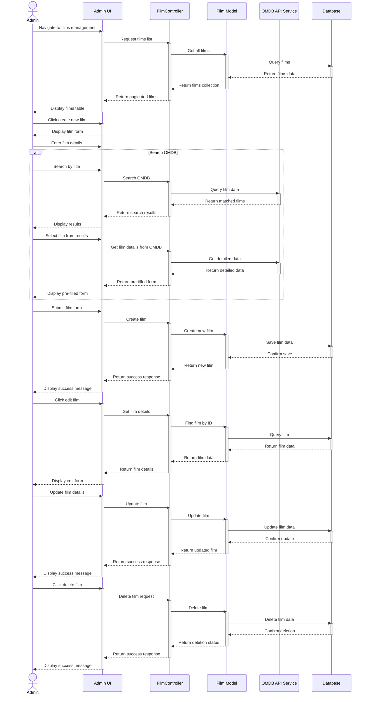
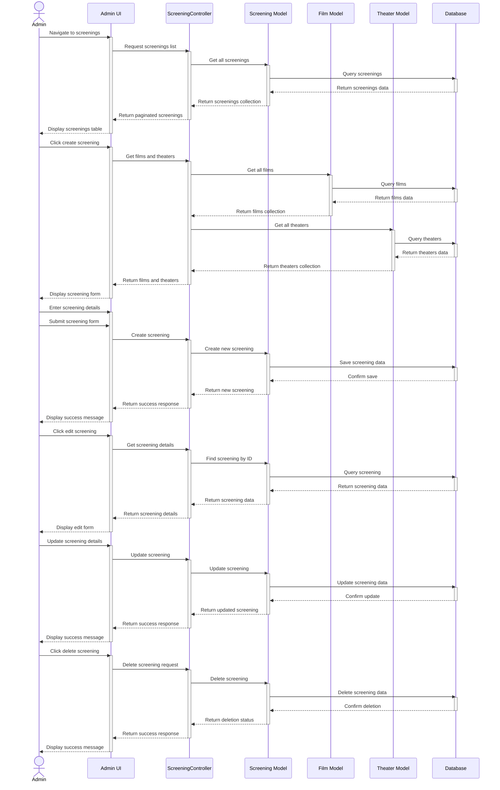
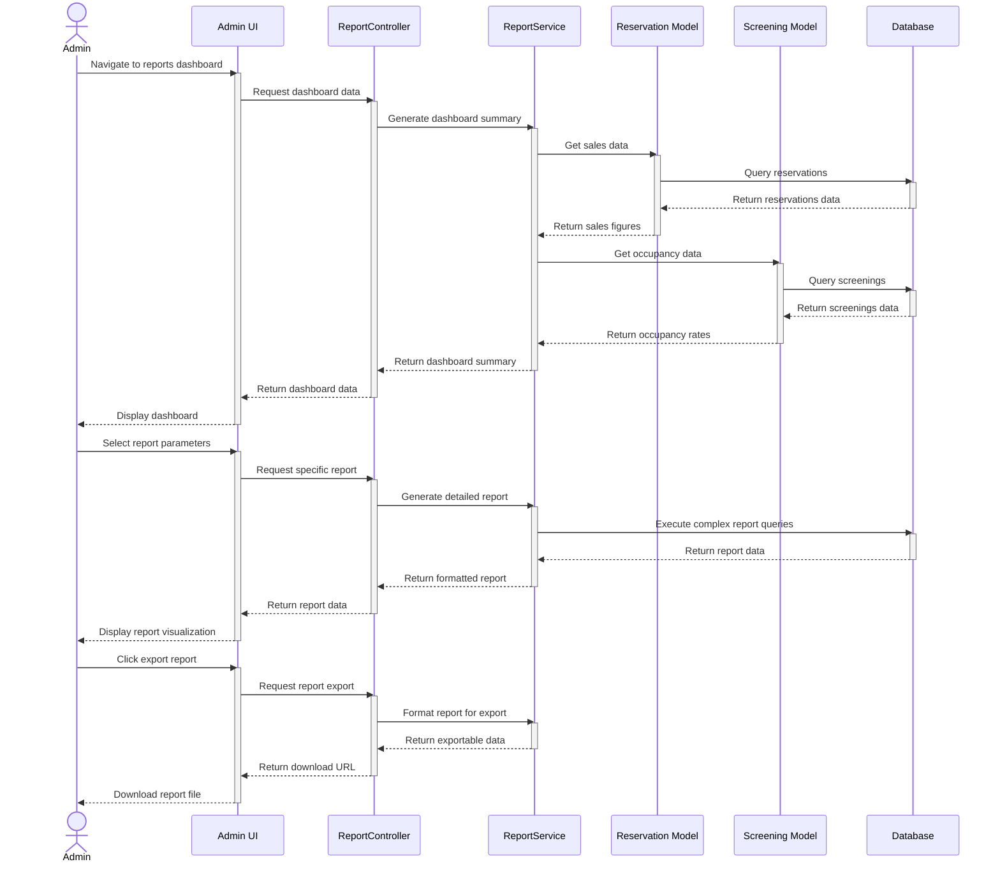
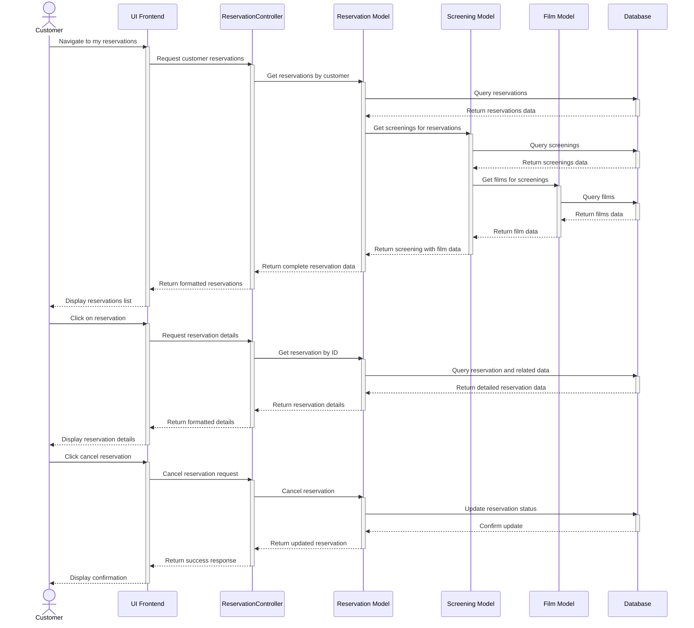

# CineVerse UML Diagrams

This document contains detailed UML diagrams for the CineVerse cinema management system.

## Use Case Diagram

## Class Diagram

## Sequence Diagrams

### User Registration and Login

### Browsing and Searching Films

### Making a Reservation

### Admin Film Management

### Admin Screening Management

### Admin Reporting

### Customer Viewing Reservations

